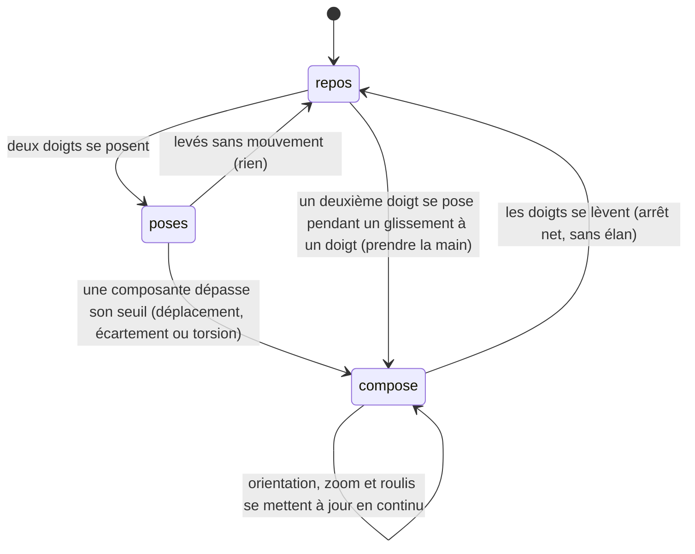

# Le geste composé

## Résumé

Deux doigts posés sur la scène commandent trois choses à la fois, dans un même mouvement continu : le glissement des deux doigts oriente la caméra (comme l'[orbite libre](orbite-libre.md), mais avec une précision réduite à 72 %), le pincement règle le zoom, la torsion règle le roulis. Les trois se combinent librement — on peut s'approcher d'une planète en tournant autour et en inclinant l'horizon, sans lever les doigts. Le geste composé s'arrête avec les doigts : contrairement à l'orbite libre, il n'a jamais d'élan. S'il commence pendant un glissement à un doigt, il *prend la main* : le glissement est annulé net, sans élan. Une exception : quand une sonde est sélectionnée, le pincement ne règle pas la distance de caméra mais l'ampleur du cadrage de sa trajectoire, de 0,3× à 3×.

## Le cas simple

L'utilisateur pose deux doigts sur la scène et les écarte : la caméra s'approche de sa cible. Il les fait tourner l'un autour de l'autre : l'image pivote autour de l'axe de visée — le plan des orbites, d'habitude à plat, peut se dresser dans l'écran. Il glisse les deux doigts ensemble vers la gauche : la scène tourne devant lui, un peu moins vite que d'un seul doigt, ce qui donne un contrôle plus fin.

Tout se fait en même temps, sans mode ni ordre imposé : le mouvement des doigts est décomposé en continu en écartement, torsion et déplacement, et chaque composante agit sur son axe. Il n'y a pas de « verrouillage » sur la composante dominante : même un pincement franc emporte un peu d'orientation si les doigts dérivent, et c'est voulu — le geste est une manipulation à main levée, pas trois outils séparés.

> Note technique : les trois composantes sont trois reconnaisseurs distincts autorisés à se reconnaître simultanément, chacun livrant ses deltas image par image. C'est ce qui rend la combinaison continue possible — et c'est aussi pourquoi le geste composé ne doit jamais avoir d'élan : les vitesses de plusieurs reconnaisseurs ne doivent jamais s'additionner.

Il lève les doigts : tout s'arrête exactement là où le geste l'a laissé. Pas de rotation résiduelle, pas de zoom qui continue — la manipulation est directe de bout en bout.

## L'interaction, événement par événement

### Les doigts se posent

Rien ne se passe encore. Si un glissement à un doigt était en cours au moment où le deuxième doigt se pose, il est annulé dès que le geste composé s'engage — pas au simple contact. Si un élan d'orbite libre est en cours, il continue jusqu'à l'engagement.

### Levés sans mouvement

Les deux doigts se lèvent sans avoir bougé : rien. Pas de sélection — le tap est un geste à un doigt, un contact à deux doigts ne compte pas comme un tap. La caméra, la date et la sélection sont exactement ce qu'elles étaient.

### Le geste s'engage

Les trois composantes s'engagent chacune à son propre seuil système : il suffit que les doigts se déplacent assez (orientation), s'écartent ou se resserrent assez (zoom), ou tournent assez (roulis). En pratique un mouvement naturel les engage presque ensemble. À l'engagement de chaque composante :

- le glissement à un doigt en cours, s'il y en avait un, est annulé immédiatement et sans élan — c'est *prendre la main* (voir [Gestes et caméra](../foundations/gestes-et-camera.md#larbitrage--qui-prend-la-main-sur-qui)) ;
- tout élan d'orbite libre est remis à zéro ;
- l'orientation et le roulis abandonnent toute visée de caméra programmée (recadrage vers une sonde, un satellite, un pas de tir) — le doigt gagne toujours ;
- le zoom capture la distance (ou l'ampleur) du moment : tout le pincement sera mesuré par rapport à cet instant.

> Note technique : le pincement, lui, n'abandonne pas la visée d'orientation — ce n'est pas un geste d'orientation. Un pincement pur, sans glissement ni torsion, laisse la caméra finir son recadrage angulaire pendant que la distance obéit aux doigts. Il reprend en revanche la main sur toute animation de distance en cours.

### Pendant le geste

Chaque image, les trois axes suivent les doigts :

- **Orientation.** Comme l'orbite libre, à 72 % de sa sensibilité : glisser à gauche fait défiler la scène vers la droite du regard, glisser vers le haut élève le point de vue. L'azimut est libre, l'élévation bute juste avant les pôles. Les constantes sont dans [Gestes et caméra](../foundations/gestes-et-camera.md#le-rig-de-caméra).
- **Zoom.** Écarter approche, resserrer éloigne. Le facteur s'applique à la distance capturée au début du pincement — pas de dérive cumulative : revenir à l'écartement initial rend exactement la distance initiale. La distance est bornée ; voir [Gestes et caméra](../foundations/gestes-et-camera.md#le-zoom-et-son-exception).
- **Roulis.** L'image tourne avec les doigts, degré pour degré, autour de l'axe de visée. Manipulation directe, sans borne : on peut faire des tours complets.

**L'exception de la sonde** : si une sonde est sélectionnée, la distance de caméra est calculée par l'app pour cadrer la trajectoire parcourue. Le pincement règle alors l'*ampleur* de ce cadrage, entre 0,3× (serré sur la sonde) et 3× (large), au lieu de la distance. À l'œil, le geste reste un zoom — mais c'est le cadrage qui respire, et l'app garde la main sur la distance réelle.

La cible reste verrouillée au centre du cadre (ou décalée si le cartouche est déplié) ; la date, la sélection et le contenu du cartouche ne bougent pas.

### Les doigts se lèvent

Tout s'arrête net, à l'endroit exact où le geste l'a laissé : ni élan d'orientation, ni zoom résiduel, ni roulis qui continue. Le geste composé n'a jamais d'élan, quelle que soit la vivacité du lâcher — c'est voulu, pour que les vitesses de plusieurs gestes ne puissent jamais s'additionner (voir [Gestes et caméra](../foundations/gestes-et-camera.md#larbitrage--qui-prend-la-main-sur-qui)).

Lever un seul doigt termine le geste composé ; le doigt restant ne rend pas la main à l'orbite libre en cours de route. S'il continue de glisser, ses derniers mouvements ne déclenchent pas d'élan : pendant une demi-seconde après toute activité à deux doigts, un lever de doigt est traité comme un doigt qui traîne, jamais comme un lancer.

Rien n'est « acté » : angle, distance, roulis et ampleur ne sont pas persistés, le geste suivant repart de là.

## Variantes

| Variante | Au début du geste | Pendant le geste |
| --- | --- | --- |
| Sélection courante | La caméra orbite autour de l'astre sélectionné. Si c'est une sonde, le pincement capture l'ampleur courante au lieu de la distance. | Sans objet — la sélection ne peut pas changer pendant le geste (le tap ne déclenche pas). |
| Panneau Explorer ouvert | Aucun effet : le geste fonctionne sur la scène, le panneau reste ouvert. | Aucun effet. |
| Cartouche déplié | Le geste fonctionne sur la partie visible de la scène ; le cadrage reste décalé vers la moitié haute, zoom et roulis compris. | Aucun effet. |
| Échelle de temps choisie | Aucun effet : le geste composé ignore le pas de la timeline. | Aucun effet. |

Seule la sélection d'une sonde change réellement l'issue du geste (l'exception du pincement) ; les autres variantes n'ont pas d'influence.

## Annulation et interruption

| Événement | Avant l'engagement (doigts posés) | Pendant le geste |
| --- | --- | --- |
| Taper le vide | Impossible : le tap est à un doigt, et il ne se reconnaît jamais en même temps qu'un geste de scène. | Impossible, pour la même raison. |
| Un deuxième doigt se pose | C'est ce qui *crée* ce geste : posé pendant un glissement à un doigt, il prend la main dès l'engagement. | Un troisième doigt est ignoré : le geste continue sur les deux premiers. |
| Une transition de date démarre | Impossible sans lever les doigts (elle vient d'un bouton ou d'une liste). | Impossible pendant le geste, pour la même raison. |
| Le système annule le toucher | Rien n'avait commencé ; rien à annuler. | Le geste s'arrête là où il en est — sans élan, comme toute fin de geste composé. Angle, distance, roulis conservés. |
| L'app passe en arrière-plan | Rien n'avait commencé. | Même chose : arrêt net, tout est conservé au retour. |
| La cible disparaît | Sans objet. | La caméra continue d'orbiter autour du dernier point connu. Si c'est la sonde sélectionnée qui disparaît (le temps défile hors de sa période), la caméra recule vers la vue d'ensemble et le pincement règle une ampleur devenue invisible (voir Cas limites). |
| Le réseau manque | Aucun effet : le geste est entièrement local. | Aucun effet. |
| L'appareil pivote | Le geste ne s'engage pas différemment. | Le geste continue ; les mouvements des doigts sont interprétés dans le nouveau repère de l'écran. |

Comme pour l'orbite libre, aucun état partiel n'existe : un geste composé interrompu est indistinguable d'un geste composé terminé — l'arrêt net *est* sa fin normale.

## Interactions avec les autres systèmes

**Caméra et cadrage.** Le geste possède les quatre nombres du rig à la fois : azimut, élévation (à 72 %), roulis et distance (ou ampleur). L'orientation et le roulis abandonnent la visée programmée à l'engagement ; le pincement reprend la main sur l'animation de distance. Constantes et bornes dans [Gestes et caméra](../foundations/gestes-et-camera.md).

**Temps simulé.** Aucune interaction : le geste ne lit ni n'écrit la date. Si le temps défile pendant le geste (élan de timeline), la caméra suit sa cible en mouvement tout en obéissant aux doigts.

**Sélection.** Le geste ne change jamais la sélection ; il en dépend deux fois : pour savoir autour de quoi orbiter, et pour savoir si le pincement règle la distance ou l'ampleur. Changer de sonde remet l'ampleur à 1 ; taper le vide remet le roulis à zéro (voir [Toucher un astre](../selection/toucher-un-astre.md)).

**Réseau et replis.** Aucune interaction.

**Échelles compressées.** Le zoom traverse l'espace de scène compressé : un même écartement de doigts couvre beaucoup plus de kilomètres réels loin du Soleil que près de la Terre. Les angles (orientation, roulis), eux, ne sont pas compressés.

**Localisation et langue.** Aucune interaction : le geste n'affiche aucun texte.

**Accessibilité.** Le geste composé n'a pas d'équivalent accessibilité (pas d'action VoiceOver pour zoomer ou rouler). La scène ne propose aucun contrôle alternatif de caméra.

## Cas limites

- **Bouger un seul des deux doigts, l'autre posé immobile** : c'est toujours le geste composé qui répond — le glissement à un doigt ne s'engage jamais tant que deux doigts sont posés. Le déplacement est mesuré au point médian des deux doigts, donc l'orientation avance environ moitié moins vite, et le mouvement produit au passage un peu de zoom et de roulis.
- **Pincer pendant un recadrage programmé** : un pincement pur laisse la visée d'orientation se finir — la caméra continue de tourner vers son but pendant que la distance suit les doigts. Dès que les doigts glissent ou tordent, la visée est abandonnée.
- **Écarter au-delà de la borne de distance** : la caméra bute et l'écartement excédentaire est « perdu » ; pour repartir en arrière, il faut d'abord resserrer jusqu'à repasser le point où la borne a été atteinte. Le zoom étant mesuré depuis le début du pincement, ce petit temps mort se rembobine ; il disparaît en relâchant et repinçant.
- **Relâcher et repincer** : chaque pincement repart de la distance (ou l'ampleur) du moment ; les facteurs ne se cumulent jamais entre deux pincements.
- **Pincer sur une sonde sélectionnée mais invisible** (la date est sortie de sa période) : le pincement règle l'ampleur, mais la caméra est en vue d'ensemble — rien ne bouge à l'écran. L'ampleur réglée s'appliquera quand la sonde réapparaîtra. Signalé comme défaut possible.
- **Atteindre la butée d'élévation à deux doigts** : comme à un doigt, la vue ne monte plus mais l'azimut, le zoom et le roulis continuent de répondre.
- **Tordre plusieurs tours** : le roulis suit sans limite ; l'angle est replié en interne (±180°), sans effet visible.
- **Lever un doigt et continuer avec l'autre** : le doigt restant ne reprend pas l'orbite libre en cours de route, et ses derniers mouvements ne créent pas d'élan (fenêtre d'une demi-seconde après le geste à deux doigts). Pour retrouver l'élan, lever tout et recommencer un glissement à un doigt.
- **Poser les deux doigts l'un après l'autre** : le premier peut engager un glissement à un doigt une fraction de seconde ; il est annulé sans élan dès que le geste composé s'engage. À l'œil, la transition est invisible.

## Questions ouvertes et vérification

- Les seuils d'engagement des trois composantes (déplacement, écartement, torsion) sont ceux des reconnaisseurs système, non redéfinis par l'app ; valeurs non mesurées.
- Le devenir du doigt restant après le lever de l'autre est lu dans le code (fenêtre anti-élan de 0,5 s) mais pas observé : il n'est pas exclu qu'un doigt restant qui continue de glisser engage un *nouveau* glissement à un doigt, à pleine sensibilité, avant la fin de la fenêtre. À vérifier sur appareil.
- Deux doigts posés puis levés sans mouvement : « rien ne se passe » est déduit du fait que le tap est à un doigt ; non vérifié sur appareil.
- Le comportement d'un troisième doigt (ignoré) est déduit des reconnaisseurs système ; non observé.
- La mesure du déplacement au point médian des deux doigts (et la demi-vitesse qui en découle quand un seul doigt bouge) est le comportement standard du reconnaisseur système ; non mesurée sur appareil.
- La raison de la précision à 72 % n'est pas donnée dans le code ; l'intention supposée (contrôle plus fin quand on combine) n'est pas documentée.
- Le pincement interrompu par le système ne repasse par aucun nettoyage explicite dans le code (la distance reste simplement où elle est) ; sans conséquence identifiée, non vérifié.
- L'ampleur réglée sur une sonde invisible (voir Cas limites) ressemble à un défaut : aucun retour visuel, et un réglage « fantôme » s'applique plus tard. À trancher en triage.
- Des traces de débogage (`print`) subsistent dans le code des gestes ; invisibles pour l'utilisateur, elles ne sont pas un défaut produit.

Vérifié contre le dossier natif au commit `ddd8314`.
