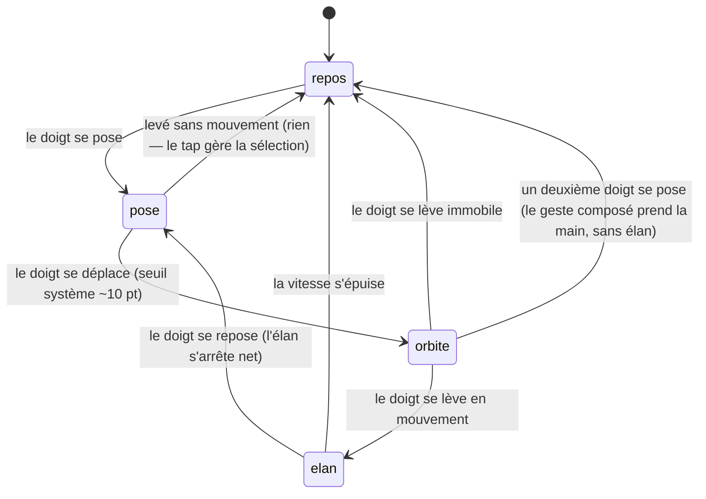

# L'orbite libre

## Résumé

Un glissement à un doigt sur la scène fait tourner la caméra autour de sa cible : horizontalement autour de l'axe vertical (azimut), verticalement jusqu'à la limite des pôles (élévation). Le doigt levé, la rotation continue sur son élan puis s'amortit. Le geste est disponible partout et tout le temps — avec ou sans sélection, panneau ouvert ou non, cartouche déplié ou non — dès lors que le doigt se pose sur la scène et non sur un élément d'interface posé dessus (dock, cartouche, panneau Explorer, poignée de timeline). Il ne change jamais ni la sélection, ni la date simulée, ni la distance de caméra : seulement l'angle de vue.

## Le cas simple

L'utilisateur pose un doigt sur la scène et glisse vers la gauche : le système solaire tourne devant lui, comme s'il tournait autour du Soleil. Il glisse vers le haut : son point de vue s'élève au-dessus du plan des orbites, jusqu'à la vue de dessus s'il insiste — la caméra s'arrête juste avant la verticale exacte, l'image ne bascule jamais tête en bas.

Il lâche l'écran en plein mouvement : la rotation continue dans la direction du geste, en ralentissant progressivement, puis s'arrête d'elle-même après une à deux secondes. S'il repose le doigt pendant cet élan, la rotation s'arrête net et suit de nouveau le doigt.

Si un astre est sélectionné, la caméra orbite autour de lui, pas autour du Soleil : l'astre reste au centre du cadre quel que soit l'angle.

## L'interaction, événement par événement

### Le doigt se pose

Rien ne se passe encore : ni la scène ni l'interface ne réagissent au simple contact. Aucune cible n'est choisie, rien n'est capturé. Si un élan de rotation est en cours, il continue — c'est le début du *glissement*, pas le contact, qui le coupera.

### Levé sans mouvement

Le doigt se lève sans avoir bougé : c'est un tap, et c'est le geste de sélection qui le traite — voir [Toucher un astre](../selection/toucher-un-astre.md). L'orbite libre n'a rien enregistré : pas de rotation, pas d'élan, aucune trace de l'appui.

### Le geste s'engage

Dès que le doigt se déplace d'environ dix points (le seuil de reconnaissance du système), le glissement commence. À cet instant :

- toute visée de caméra programmée (un recadrage en cours vers une sonde, un satellite ou un pas de tir) est abandonnée là où elle en est — le doigt gagne toujours ;
- tout élan résiduel d'un glissement précédent est remis à zéro ;
- le roulis en cours, s'il y en avait un, reste tel quel (le glissement à un doigt ne touche pas au roulis).

Rien n'est capturé d'autre que la position du doigt : le geste est incrémental, chaque déplacement s'ajoute à l'angle courant.

> Note technique : l'abandon de visée ne concerne que l'orientation (azimut, élévation, roulis). Une animation de distance en cours — par exemple le rapprochement vers une planète qu'on vient de sélectionner — continue pendant le glissement. On peut donc orbiter pendant que la caméra plonge.

### Pendant le geste

La caméra suit le doigt en continu, dans le sens naturel : glisser à gauche fait défiler la scène vers la droite du regard, glisser vers le haut élève le point de vue.

- L'azimut tourne sans limite : on peut faire autant de tours qu'on veut.
- L'élévation est bornée juste avant chaque pôle (à 0,025 radian de la verticale) : arrivé en butée, le doigt continue de glisser mais la vue ne monte plus.
- La cible reste rigoureusement au centre du cadre : si le temps défile en même temps (élan de timeline, transition de date), la caméra suit l'astre dans son déplacement orbital tout en tournant autour de lui.

Rien d'autre ne bouge : la date, la sélection, la distance, le contenu du cartouche sont inchangés. Le geste ne peut pas sortir de l'écran — s'il atteint le bord, la rotation s'arrête simplement de progresser dans cette direction tant que le doigt n'en revient pas.

### Le doigt se lève

Si le doigt se lève en mouvement, la rotation continue sur son élan : la vitesse du geste au moment du lever devient la vitesse de rotation, plafonnée (on ne peut pas « lancer » la scène à une vitesse folle), puis décroît exponentiellement jusqu'à l'arrêt — environ une à deux secondes pour un geste vif. Si l'élévation atteint sa butée pendant l'élan, la composante verticale s'arrête net ; l'horizontale continue.

Si le doigt se lève immobile, il n'y a pas d'élan : la caméra reste exactement où le geste l'a laissée.

Dans les deux cas, rien n'est « acté » au sens d'un enregistrement : l'angle de caméra n'est pas persisté, il n'y a pas d'annulation possible ni nécessaire. Le geste suivant repart de l'angle courant.

## Variantes

| Variante | Au début du geste | Pendant le geste |
| --- | --- | --- |
| Sélection courante | La caméra orbite autour de l'astre sélectionné au lieu du Soleil. Aucune autre différence. | Sans objet — la sélection ne peut pas changer pendant un glissement (le tap ne déclenche pas). |
| Panneau Explorer ouvert | Aucun effet : le glissement sur la scène fonctionne, le panneau reste ouvert. | Aucun effet. |
| Cartouche déplié | Le glissement fonctionne sur la partie visible de la scène ; le cadrage reste décalé vers la moitié haute. | Aucun effet. |
| Échelle de temps choisie | Aucun effet : l'orbite libre ignore le pas de la timeline. | Aucun effet. |

Aucune variante ne se « verrouille » au début du geste : elles n'ont simplement pas d'influence sur lui.

## Annulation et interruption

| Événement | Avant l'engagement (doigt posé) | Pendant le geste |
| --- | --- | --- |
| Taper le vide | C'est ce lever-là qui *est* le tap : désélection (voir [Toucher un astre](../selection/toucher-un-astre.md)). | Impossible : un tap ne se reconnaît pas pendant un glissement. |
| Un deuxième doigt se pose | Le glissement à un doigt ne s'engagera pas ; le geste composé prend la main directement. | Le glissement est annulé immédiatement et sans élan ; le [geste composé](geste-compose.md) continue seul. La caméra reste où le glissement l'a laissée. |
| Une transition de date démarre | Impossible sans lever le doigt (elle vient d'un bouton ou d'une liste). | Impossible pendant le geste, pour la même raison. |
| Le système annule le toucher | Rien n'avait commencé ; rien à annuler. | Le geste s'arrête là où il en est, sans élan. La caméra garde son angle. |
| L'app passe en arrière-plan | Rien n'avait commencé. | Même chose : arrêt sans élan, angle conservé au retour. |
| La cible disparaît | Sans objet : le geste ne vise pas de cible. | La caméra continue d'orbiter autour du dernier point connu (voir [Scène et objets](../foundations/scene-et-objets.md) pour ce que devient la sélection). |
| Le réseau manque | Aucun effet : le geste est entièrement local. | Aucun effet. |
| L'appareil pivote | Le geste ne s'engage pas différemment ; l'app ne change pas de mise en page en cours d'appui. | Le glissement continue ; les déplacements du doigt restent interprétés dans le nouveau repère de l'écran. |

Après toute interruption, l'utilisateur reste exactement où il était : même sélection, même date, même angle de caméra. Aucun état partiel n'existe — un glissement interrompu est indistinguable d'un glissement terminé sans élan.

## Interactions avec les autres systèmes

**Caméra et cadrage.** C'est le geste de caméra par excellence : il possède l'azimut et l'élévation. Il abandonne toute visée programmée à l'engagement, mais laisse la distance et son animation tranquilles. Les constantes (sensibilité, bornes, amortissements) sont dans [Gestes et caméra](../foundations/gestes-et-camera.md).

**Temps simulé.** Aucune interaction : le glissement ne lit ni n'écrit la date. Si le temps défile pendant le geste, les deux se composent sans conflit — la caméra suit sa cible en mouvement.

**Sélection.** Le glissement ne change jamais la sélection ; il en dépend seulement pour savoir autour de quoi orbiter.

**Réseau et replis.** Aucune interaction.

**Échelles compressées.** Le geste tourne dans l'espace de scène compressé ; l'utilisateur n'en voit rien de particulier — les angles ne sont pas compressés, seules les distances le sont.

**Localisation et langue.** Aucune interaction : le geste n'affiche aucun texte.

**Accessibilité.** Le glissement n'a pas d'équivalent accessibilité (pas d'action VoiceOver pour orbiter). La scène ne propose aucun contrôle alternatif de caméra.

## Cas limites

- **Glisser jusqu'à la butée d'élévation puis relâcher vivement vers le haut** : seule la composante horizontale de l'élan survit ; la verticale meurt à la butée.
- **Enchaîner les glissements rapides** : chaque nouveau geste remet l'élan à zéro avant de repartir ; les vitesses ne s'additionnent jamais.
- **Poser deux doigts presque simultanément** : le glissement à un doigt peut s'engager une fraction de seconde avant le second contact ; il est alors aussitôt annulé sans élan, et seul le geste composé compte. À l'œil, la transition est invisible.
- **Lever un doigt du geste composé** : le doigt restant ne redonne *pas* la main à l'orbite libre en cours de route ; il faut le lever et recommencer un glissement.
- **Glisser pendant une séquence de tir** : la visée programmée vers le pas de tir est abandonnée, mais la plongée de distance et l'ascension de la fusée continuent — on peut regarder le tir sous l'angle qu'on veut.
- **Glisser pendant l'élan de la timeline** : les planètes se déplacent pendant qu'on tourne autour d'elles ; l'astre suivi reste centré.

## Questions ouvertes et vérification

- Le seuil d'engagement (~10 pt) est celui du reconnaisseur système, non défini dans le code de l'app ; la valeur exacte n'a pas été mesurée sur appareil.
- Le comportement à la rotation de l'appareil en plein geste (le doigt reste posé pendant que l'interface pivote) est déduit du fonctionnement standard d'UIKit, pas observé.
- La durée ressentie de l'élan (« une à deux secondes ») est calculée depuis la constante d'amortissement, pas chronométrée sur appareil.
- Des traces de débogage (`print`) subsistent dans le code des gestes ; invisibles pour l'utilisateur, elles ne sont pas un défaut produit.

Vérifié contre le dossier natif au commit `ddd8314`.
