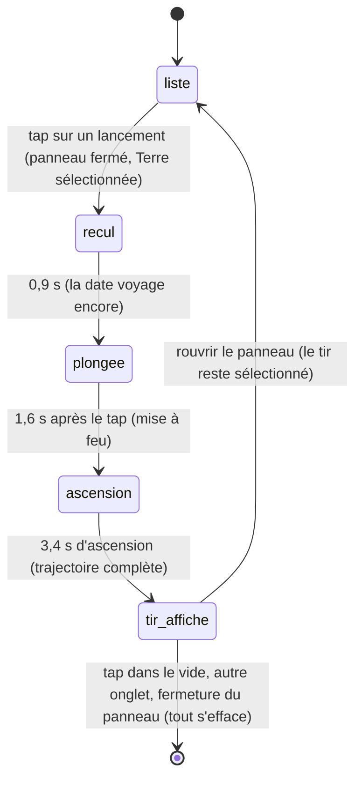

# Les lancements

## Résumé

L'onglet Lancements du panneau Explorer liste les prochains tirs réels : mission, lanceur, site, date et compte à rebours. Toucher un lancement déclenche la *séquence de tir* : le panneau se ferme, la Terre est sélectionnée, la caméra recule, la date voyage jusqu'à l'instant du tir, la caméra plonge sur le pas de tir — au bon endroit du globe, orienté comme il le sera à cette date — puis la trajectoire d'ascension se dessine en trois secondes et demie. La trajectoire reste ensuite affichée tant que le lancement est sélectionné.

## Le cas simple

L'utilisateur ouvre le panneau Explorer, onglet Lancements. Dix tirs à venir s'affichent, chacun avec sa pastille fléchée colorée, le nom de la mission, « {site} · {lanceur} », un compte à rebours vert (« J−3 · 7 h ») et la date. Il touche « Starlink Group 11-22 ».

Le panneau se ferme. Le cartouche affiche la mission et son descriptif. La caméra prend du recul sur la Terre pendant que la date file vers l'instant du tir — le globe tourne pour se mettre à l'heure. Puis la caméra plonge : le pas de tir grossit, le point précis de la côte apparaît. Une seconde plus tard, un trait lumineux s'élève du sol, vertical d'abord, puis couché vers l'est, jusqu'à l'orbite. Le trait reste ; l'utilisateur peut orbiter autour, zoomer du regard, ou déplier le cartouche pour lire la mission.

Un tap dans le vide, et tout s'efface : trajectoire éteinte, vue d'ensemble.

## L'interaction, événement par événement

L'unité racontée est le tap sur une ligne de la liste et la séquence qu'il déclenche. Le geste lui-même est un tap simple ; c'est la séquence qui a une durée.

### Le doigt se pose

Sur une ligne de la liste : l'enfoncement standard d'un bouton. Rien d'autre.

### Levé sans mouvement

Le tap déclenche tout, en un instant :

- le panneau Explorer se ferme ;
- la Terre devient la sélection ; le cartouche prend le nom de la mission, « {site} · {lanceur} » en sous-titre, et le descriptif de l'API en texte (à défaut, rien) ;
- une transition de date part vers l'instant du tir (0,95 s, poignée déposée au repos) ;
- la caméra vise le pas de tir **tel qu'il sera orienté à la date du tir** — pas là où il est à la date courante : le globe aura tourné pendant le voyage, la visée anticipe son orientation d'arrivée ;
- la trajectoire est construite : un arc qui part du pas de tir exact (latitude/longitude réelles), vertical au sol, puis basculant vers l'est jusqu'à 400 km d'altitude et une vingtaine de degrés de distance au sol, dans la couleur de la pastille du lancement.

### Le geste s'engage

Sans objet pour le tap ; la *séquence*, elle, s'engage immédiatement et se déroule seule :

- **Recul (0 à 0,9 s)** : la caméra se tient à distance moyenne pendant que la date voyage et que le globe tourne.
- **Plongée (à 0,9 s)** : la distance cible passe d'un coup au plus près ; la caméra fond sur le pas de tir. La cible de caméra glisse du centre de la Terre vers un point à mi-hauteur de la future trajectoire.
- **Mise à feu (à 1,6 s)** : le trait commence à s'élever.

### Pendant le geste

L'ascension dure 3,4 secondes : le trait lumineux se révèle progressivement le long de l'arc, précédé d'une tête brillante — le « véhicule ». La vitesse apparente suit la géométrie de l'arc : rapide à la verticale, s'allongeant vers l'est. Pendant toute la séquence, l'utilisateur garde la main : orbiter interrompt la visée (pas la plongée ni l'ascension), et le cartouche est utilisable.

L'ascension ne se joue qu'une fois par sélection : arrivée en haut, la trajectoire complète reste affichée, la tête lumineuse au sommet.

### Le doigt se lève

Sans objet — tout est déclenché au tap. Ce qui met fin à l'état « tir affiché » : un tap dans le vide (tout s'efface, vue d'ensemble), le passage à un autre onglet du panneau, ou la fermeture du panneau — ces deux derniers effacent la trajectoire mais gardent la Terre sélectionnée. Retoucher la même ligne dans la liste rejoue la séquence entière depuis le recul.

## Variantes

| Variante | Au moment du tap | Pendant la séquence |
| --- | --- | --- |
| Sélection courante | Remplacée par la Terre quel que soit l'état précédent ; une trace de sonde affichée s'éteint. | Toucher un astre change la sélection mais pas le cadrage — voir Cas limites. |
| Panneau Explorer ouvert | Il l'est forcément (la liste y vit) ; il se ferme au tap. | Le rouvrir n'interrompt rien ; y repasser sur un autre onglet efface le tir. |
| Cartouche déplié | Se replie (changement de sélection). | Peut être déplié pour lire la mission ; le cadrage se décale vers le haut normalement. |
| Échelle de temps choisie | Aucun effet : la transition de date est identique à tous les pas. | Aucun effet. |

## Annulation et interruption

| Événement | Avant le tap (liste affichée) | Pendant la séquence / tir affiché |
| --- | --- | --- |
| Taper le vide | Impossible depuis la liste (le panneau couvre le bas de l'écran ; au-dessus, c'est un tap de scène ordinaire). | Tout s'efface : trajectoire, sélection du lancement, sélection de la Terre ; vue d'ensemble. |
| Un deuxième doigt se pose | Sans effet sur la liste. | Le geste composé fonctionne normalement ; la séquence continue. |
| Une transition de date démarre | Sans objet. | Un lien de date ou « Aujourd'hui » emporte la date ailleurs : la trajectoire et la caméra restent sur le pas de tir — voir Cas limites. |
| Le système annule le toucher | Rien ne se déclenche. | La séquence continue seule ; rien à interrompre côté doigt. |
| L'app passe en arrière-plan | Rien. | Au retour, la séquence a avancé sur l'horloge réelle — le plus souvent, le tir est affiché en entier. |
| La cible disparaît | Sans objet : la Terre ne disparaît jamais. | Sans objet. |
| Le réseau manque | La liste montre les lancements du cache, sinon les trois lancements illustratifs embarqués ([Données et réseau](../foundations/donnees-et-reseau.md)). La séquence fonctionne à l'identique sur les replis. | Aucun effet. |
| L'appareil pivote | La liste se recompose. | La séquence continue dans le nouveau cadre. |

## Interactions avec les autres systèmes

**Caméra et cadrage.** La séquence pilote les trois nombres à la fois : visée anticipée du pas de tir, cible glissant du globe vers la trajectoire, distance en deux temps (recul puis plongée). Orbiter à la main pendant la séquence abandonne la visée mais pas la plongée. Tant qu'un lancement est sélectionné, la distance est imposée en continu — voir Cas limites pour l'effet sur le zoom.

**Temps simulé.** La sélection déclenche une transition de date vers l'instant du tir. La date reste ensuite libre : la trajectoire affichée ne dépend plus de la date.

**Sélection.** Le lancement sélectionné est un état séparé de la sélection d'astre, qui se cumule avec « Terre sélectionnée ». Le glossaire les distingue ; [toucher un astre](../selection/toucher-un-astre.md) décrit ce qu'un tap d'astre fait à chacun.

**Réseau et replis.** Liste et descriptifs viennent de l'API ; repli sur trois tirs illustratifs à dates relatives. Le compte à rebours utilise l'heure réelle, se rafraîchit toutes les minutes, affiche le statut du tir s'il n'est pas « Go », et « En cours » une fois l'heure passée.

**Échelles compressées.** L'arc d'ascension vit dans l'échelle compressée du voisinage terrestre : ses 400 km d'altitude paraissent hauts par rapport au globe. Direction et point de départ sont exacts.

**Localisation et langue.** Dates de la liste en français abrégé ; les noms de mission et descriptifs de l'API sont en anglais, tels quels.

**Accessibilité.** Les lignes de la liste sont des boutons ordinaires, lisibles par VoiceOver. La séquence n'a pas de description sonore ni de récapitulatif textuel au-delà du cartouche.

## Cas limites

- **Le zoom est inopérant tant qu'un lancement est sélectionné** : la séquence impose la distance à chaque image ; le pincement est aussitôt écrasé. L'utilisateur qui veut prendre du recul sur le tir n'a pas d'autre issue que de désélectionner. Défaut probable — consigné en questions ouvertes.
- **Toucher un astre pendant que le tir est affiché** : la sélection d'astre change (le cartouche suit) mais la caméra reste cadrée sur la trajectoire de lancement, qui garde la priorité. Il faut un tap dans le vide, un changement d'onglet ou une sélection de sonde pour libérer la caméra. Incohérence probable — consignée.
- **Retoucher le même lancement** rejoue la séquence entière, recul et plongée compris.
- **Sélectionner un lancement passé de peu** (statut « En cours ») : même séquence ; la transition de date va à l'heure du tir, dans le passé proche.
- **Les trois lancements de repli** ont des dates relatives au lancement de l'app ; leur globe d'arrivée est orienté en conséquence. Ils se comportent exactement comme les vrais.
- **Emporter la date ailleurs pendant le tir affiché** (lien de date du cartouche) : le globe tourne sous la trajectoire, qui reste accrochée à son pas de tir et tourne avec lui ; la caméra reste sur place. Cohérent mais étrange à l'œil pour de grands écarts de date.

## Questions ouvertes et vérification

- **Zoom écrasé pendant la sélection d'un lancement** : lu dans le code (la distance est réécrite à chaque image tant qu'un lancement est sélectionné) ; à confirmer sur appareil, puis à traiter comme bug plutôt que comme comportement.
- **Caméra prisonnière du tir après sélection d'un autre astre** : le cadrage du lancement prime sur la sélection d'astre tant que le lancement n'est pas désélectionné ; à confirmer, probablement à trancher côté produit.
- Le moment exact de la mise à feu par rapport à la fin de la transition de date (1,6 s contre 0,95 s : le tir part après l'arrivée de la date) est lu dans les constantes ; l'enchaînement ressenti est à vérifier.
- Le comportement au retour d'arrière-plan en pleine séquence (saut sur l'horloge réelle) est déduit, non observé.
- La liste ne se rafraîchit qu'au lancement de l'app : une session laissée ouverte montre des comptes à rebours justes sur des tirs périmés (déjà partis, reportés). Recoupe la question ouverte de [Données et réseau](../foundations/donnees-et-reseau.md).

Vérifié contre le dossier natif au commit `ddd8314`.
