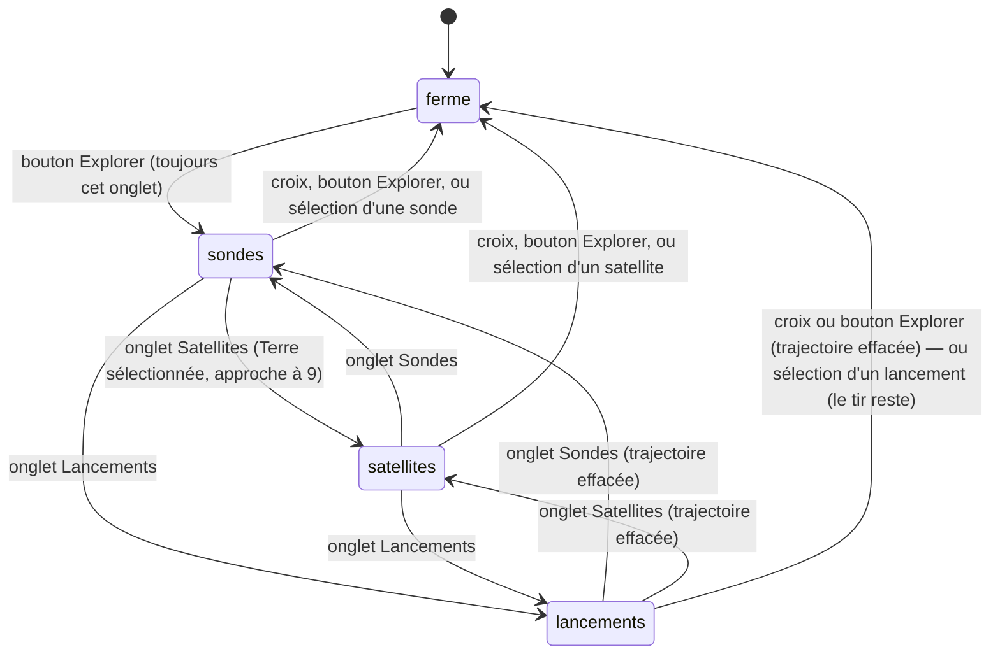

# Le dock et le panneau Explorer

## Résumé

Le dock est la barre posée en bas de l'écran : le bouton Explorer à gauche, le cartouche au centre, le bouton d'échelle à droite. Le bouton Explorer ouvre le panneau Explorer, un panneau à trois onglets — Sondes, Satellites, Lancements — qui apparaît juste au-dessus du dock. Le panneau s'ouvre toujours sur l'onglet Sondes ; on en change d'un tap, on le ferme à la croix, au bouton Explorer, ou simplement en sélectionnant quelque chose dans une liste. Deux onglets ont des effets de bord : activer Satellites sélectionne la Terre et en rapproche la caméra ; quitter Lancements désélectionne le lancement courant et efface sa trajectoire. Le contenu des listes appartient à [Sondes](sondes.md), [Satellites](satellites.md) et [Lancements](lancements.md) ; ce document possède le contenant.

## Le cas simple

En bas de l'écran, deux boutons ronds de 46 points encadrent le cartouche : à gauche un cercle marqué ◎ (le bouton Explorer), à droite une lettre — « J » par défaut, l'échelle de temps courante (le bouton d'échelle, qui ouvre le [menu d'échelle](../timeline/echelle-et-aujourdhui.md)). Le [cartouche](../selection/cartouche.md) occupe le centre ; quand il se déplie, les deux boutons s'estompent, rétrécissent et deviennent intouchables — le dock tout entier devient la feuille. Ces trois éléments sont le dock ; le reste de ce document raconte le bouton de gauche et ce qu'il ouvre.

L'utilisateur touche le bouton Explorer : un panneau sombre aux coins arrondis surgit au-dessus du dock, en grandissant depuis le coin bas-gauche avec un fondu (0,18 s). En tête, trois onglets — Sondes, Satellites, Lancements — dont le premier est allumé (fond clair, texte sombre), et une croix à droite. Dessous, la grille des 26 sondes, défilable.

Il touche l'onglet Satellites : la liste change instantanément, et dans la scène, la caméra glisse vers la Terre — la Terre est maintenant sélectionnée, le cartouche affiche « Terre ». Pendant que le panneau est ouvert, le bouton de gauche a changé de visage : il est inversé (fond clair) et son glyphe suit l'onglet actif — ✦ pour Sondes, ▣ pour Satellites, ↑ pour Lancements. Le retoucher, ou toucher la croix, referme le panneau de la même animation inversée. Sélectionner une ligne dans n'importe quelle liste le ferme aussi, tout seul.

## L'interaction, événement par événement

Tout ici est tap simple : boutons du dock, onglets, croix, lignes de liste. Il n'y a ni glissement, ni seuil, ni élan — seule la liste défile au doigt, comme n'importe quelle liste iOS.

### Le doigt se pose

Le bouton touché se contracte légèrement (96 % de sa taille) pour marquer l'appui. Rien d'autre : aucune action ne part au contact, et poser le doigt sur le panneau n'interfère avec aucun geste de scène en cours — un élan d'orbite continue de tourner derrière.

### Levé sans mouvement

C'est le tap : l'action part au lever du doigt.

- **Bouton Explorer, panneau fermé** : le panneau s'ouvre, toujours sur l'onglet Sondes — jamais sur le dernier onglet visité. Si le menu d'échelle était ouvert, il se referme en même temps.
- **Bouton Explorer, panneau ouvert** : le panneau se ferme. S'il était sur Lancements avec un lancement sélectionné, le lancement est désélectionné et sa trajectoire effacée ; la Terre reste sélectionnée.
- **Un onglet** : la liste change instantanément (sans animation de contenu), le glyphe du bouton Explorer suit. Deux onglets ont un effet de bord au moment où on y *entre* ou dont on *sort* :
  - **entrer dans Satellites** sélectionne la Terre (remplaçant toute sélection en cours) et amène la caméra à la distance 9, sans changer l'angle de vue ; la note de fraîcheur des TLE est rafraîchie au passage ;
  - **sortir de Lancements** (vers un autre onglet comme vers la fermeture) désélectionne le lancement courant et efface sa trajectoire de la scène ; la Terre reste sélectionnée. Entrer dans Lancements, lui, ne fait rien de plus qu'afficher la liste.
- **La croix** : même effet que le bouton Explorer panneau ouvert.
- **Le bouton d'échelle** : ouvre le [menu d'échelle](../timeline/echelle-et-aujourdhui.md) — sans fermer le panneau Explorer s'il est ouvert.
- **Une ligne de liste** : la sélection correspondante (voir les documents de liste), et le panneau se ferme de lui-même.

### Le geste s'engage / pendant le geste

Sans objet : un tap n'a pas de phase étendue. Glisser le doigt hors d'un bouton avant de le lever annule le tap (comportement standard des boutons) ; glisser sur la liste la fait défiler dans sa zone, haute d'au plus 360 points, sans jamais déplacer le panneau lui-même.

### Le doigt se lève

L'action décrite en « Levé sans mouvement » est déjà tout : rien n'est différé, rien n'est annulable. L'état du panneau (ouvert/fermé, onglet actif) n'est pas persisté entre les lancements de l'app — elle démarre panneau fermé.

> Note technique : la sélection d'une sonde ferme le panneau quel que soit le chemin — y compris un tap sur l'octaèdre dans la scène pendant que le panneau est ouvert. Les autres sélections de scène (planète, lune, satellite) le laissent ouvert ; seules les sélections *depuis les listes* de satellites et de lancements le ferment. L'asymétrie vient de l'endroit du code où la fermeture est posée.

## Variantes

| Variante | Au début du geste | Pendant le geste |
| --- | --- | --- |
| Sélection courante | Ouvrir ou fermer le panneau n'y touche pas. Activer l'onglet Satellites la *remplace* par la Terre, quelle qu'elle fût (sonde, lune, autre planète). | Sans objet — un tap n'a pas de phase étendue. |
| Panneau Explorer ouvert | Le bouton Explorer ferme au lieu d'ouvrir ; son glyphe reflète l'onglet actif (✦ ▣ ↑ au lieu de ◎). | Sans objet. |
| Cartouche déplié | Les deux boutons du dock sont estompés et intouchables (voir [Le cartouche](../selection/cartouche.md)) : impossible d'ouvrir le panneau ou le menu d'échelle. Un panneau déjà ouvert, lui, reste ouvert et utilisable. | Sans objet. |
| Échelle de temps choisie | Aucun effet : le panneau ignore le pas. Le bouton d'échelle affiche la lettre du pas courant (H, J, M ou A). | Sans objet. |

## Annulation et interruption

Les taps étant instantanés, la colonne « pendant le geste » se réduit à l'appui en cours ; l'essentiel se joue sur l'état « panneau ouvert ».

| Événement | Pendant l'appui | Panneau ouvert, au repos |
| --- | --- | --- |
| Taper le vide | Sans objet (l'appui est sur un bouton, pas sur la scène). | Le panneau **reste ouvert**. La sélection et le lancement sont désélectionnés, la trajectoire effacée, vue d'ensemble — même onglet affiché, mais plus rien d'allumé dans la liste. |
| Un deuxième doigt se pose | Le tap du premier doigt ne part pas ; aucun geste de panneau à deux doigts n'existe. | Aucun effet : le geste composé travaille la scène derrière, le panneau ne bouge pas. |
| Une transition de date démarre | Impossible pendant l'appui. | Aucun effet sur le contenant. Le contenu des listes peut changer avec la date (lignes « lancé en… », note SGP4) — voir les documents de liste. |
| Le système annule le toucher | Le bouton relâche sans agir. | Rien : le panneau reste tel quel. |
| L'app passe en arrière-plan | L'appui est perdu, sans action. | Le panneau et son onglet sont retrouvés tels quels au retour. |
| La cible disparaît | Sans objet. | Le panneau ne réagit pas ; les lignes concernées changent de sous-titre (possédé par [Satellites](satellites.md) et [Sondes](sondes.md)). |
| Le réseau manque | Sans objet. | La structure ne change pas ; les listes tournent sur leurs replis ([Données et réseau](../foundations/donnees-et-reseau.md)). |
| L'appareil pivote | L'appui suit le bouton dans la nouvelle mise en page. | Le panneau se recompose dans la nouvelle largeur (plafonnée à 520 points, marges de 16). |

## Interactions avec les autres systèmes

**Caméra et cadrage.** Ouvrir, fermer le panneau ou changer d'onglet ne déplace jamais la caméra — à une exception : activer Satellites impose la distance 9 vers la Terre, sans changer l'angle de vue. Quitter Lancements efface la trajectoire mais laisse la caméra où elle est. Les gestes de scène restent entièrement disponibles panneau ouvert ([L'orbite libre](../camera/orbite-libre.md)).

**Temps simulé.** Le panneau ne lit ni n'écrit la date. Les sélections faites *dans* ses listes peuvent en déclencher une transition ([Sondes](sondes.md), [Lancements](lancements.md)), mais l'ouverture, la fermeture et les onglets eux-mêmes n'y touchent pas.

**Sélection.** Trois écritures : l'onglet Satellites sélectionne la Terre ; quitter l'onglet Lancements (autre onglet, croix, bouton Explorer, réouverture) désélectionne le lancement en gardant la Terre sélectionnée ; et toute sélection depuis une liste ferme le panneau. Taper le vide désélectionne sans fermer.

**Réseau et replis.** Le contenant est local ; seules les listes dépendent du réseau. Aucun indicateur de chargement dans le panneau lui-même, hormis la note de l'onglet Satellites (« Chargement des éléments orbitaux… », possédée par [Satellites](satellites.md)).

**Échelles compressées.** La distance 9 de l'onglet Satellites place la caméra dans l'espace compressé autour de la Terre (globe à 1,2, Lune à 3,1) : assez loin pour voir toutes les orbites de satellites, assez près pour les distinguer.

**Localisation et langue.** Tous les libellés (onglets, bascules, notes) sont en français, en dur : l'app n'est pas localisée.

**Accessibilité.** Les onglets exposent leur texte aux technologies d'assistance. La croix et le bouton Explorer n'ont pas de libellé d'accessibilité explicite : la croix est un symbole système, le bouton Explorer un caractère typographique (◎ ✦ ▣ ↑) — ce que VoiceOver en lit n'a pas été vérifié. Quand le cartouche est majoritairement déplié, les boutons du dock sont masqués aux technologies d'assistance.

## Cas limites

- **Retoucher l'onglet Satellites déjà actif** rejoue son effet de bord : la Terre est resélectionnée et la caméra ramenée à la distance 9, même si l'utilisateur s'était éloigné au zoom entre-temps. Retoucher Sondes ou Lancements déjà actifs ne fait rien.
- **Rouvrir le panneau après une séquence de tir** l'ouvre sur Sondes — et ce passage hors de Lancements désélectionne le lancement et efface sa trajectoire. Il n'y a aucun moyen de rouvrir le panneau en gardant le tir affiché.
- **Rouvrir le panneau pendant la séquence de tir** (la caméra recule ou plonge encore) a le même effet, immédiatement : le tir en cours est désélectionné et son tracé retiré de la scène en plein vol ; la transition de date, elle, va à son terme ([Lancements](lancements.md) possède la séquence).
- **Menu d'échelle et panneau ouverts ensemble** : possible — le bouton d'échelle ne ferme pas le panneau. Le menu s'empile alors au-dessus du panneau. En sens inverse, ouvrir le panneau referme toujours le menu d'échelle.
- **Cartouche déplié pendant que le panneau est ouvert** : le chevron du cartouche reste accessible ; la feuille dépliée pousse le panneau vers le haut de l'écran, et les deux cohabitent.
- **Fermetures animées et fermetures sèches** : la fermeture au bouton Explorer ou à la croix est animée (0,18 s) ; la fermeture automatique à la sélection d'une ligne est posée sans animation dans le code — le rendu à l'œil est à vérifier.
- **Taper le vide depuis l'onglet Satellites** désélectionne la Terre (vue d'ensemble à 230) alors que le panneau affiche toujours la liste des satellites : l'onglet et la sélection qu'il avait imposée vivent séparément.

## Questions ouvertes et vérification

- La zone de liste est plafonnée à 360 points ; que le panneau soit toujours à cette hauteur ou se rétracte sous une liste courte n'a pas été vérifié à l'œil.
- La fermeture du panneau à la sélection d'une ligne se fait sans contexte d'animation ; disparition sèche ou fondue à l'écran, à vérifier.
- Ce que VoiceOver annonce pour le bouton Explorer (caractère ◎/✦/▣/↑) et la croix (symbole « xmark ») n'a pas été vérifié.
- Avec le cartouche déplié à mi-écran et le panneau ouvert (jusqu'à ~420 points), la cohabitation sur les petits iPhone (panneau repoussé, écrasé ou hors écran ?) est à vérifier.
- Incohérence relevée avec [Lancements](lancements.md) : son diagramme indique « rouvrir le panneau (le tir reste sélectionné) », alors que la réouverture passe par l'onglet Sondes et désélectionne donc le lancement (trajectoire effacée). À arbitrer lors de la passe de cohérence ; possible sujet de triage.

Vérifié contre le dossier natif au commit `ddd8314`.
