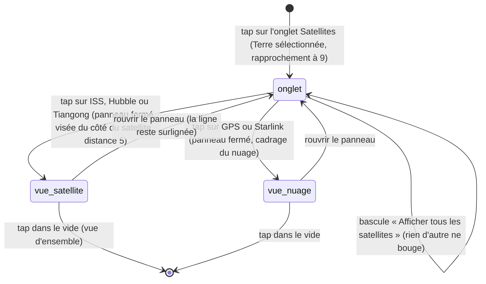

# L'onglet Satellites

## Résumé

L'onglet Satellites du panneau Explorer liste cinq engins en orbite terrestre : trois satellites individuels (ISS, Hubble, Tiangong) et deux constellations (GPS, Starlink). Ouvrir l'onglet sélectionne la Terre et en rapproche la caméra. Toucher une ligne ferme le panneau et sélectionne le satellite : pour un individuel, la caméra vient se placer de son côté du globe, son orbite se dessine et son étiquette le suit ; pour une constellation, la caméra cadre le nuage de points entier. Chaque ligne porte une méta qui suit la date simulée (altitude et inclinaison, ou « lancé en {année} » si l'engin n'existe pas encore), et le bas du panneau porte la note qui dit d'où viennent les positions et si elles sont encore fiables ([fenêtre SGP4](../foundations/donnees-et-reseau.md#les-tle-et-la-fenêtre-sgp4)).

## Le cas simple

L'utilisateur ouvre le panneau Explorer et touche l'onglet Satellites. La caméra se rapproche de la Terre — nettement plus près que pour une sélection de planète ordinaire — et le cartouche affiche « Terre ». La liste montre cinq lignes, chacune avec son glyphe sur pastille colorée, son nom et sa méta : « ISS · 417 km · 51,6° », « GPS · 31 satellites · 20 184 km · 55,4° »… En bas, la bascule « Afficher tous les satellites » (éteinte) et la note « Propagation SGP4 · TLE du 23 août 2026 ».

Il touche « ISS ». Le panneau se ferme, le cartouche prend « ISS » et sa méta en sous-titre. La caméra glisse du côté du globe où se trouve la station — pour qu'elle ne soit pas cachée derrière la Terre — et s'en approche tout près : une petite maquette à panneaux solaires, tournés vers la Terre, avec son étiquette « ISS » et son orbite dessinée en un fin trait de sa couleur, une révolution complète. S'il fait défiler le temps, la station parcourt son orbite, la caméra verrouillée sur elle.

Il rouvre le panneau et touche « Starlink » : cette fois pas de maquette mais un nuage de centaines de points, et la caméra recule pour le cadrer en entier, sans étiquette ni orbite dessinée.

### Les cinq lignes

| Ligne | Glyphe | Nature | Dans la scène |
| --- | --- | --- | --- |
| ISS | ▣ sur pastille cyan | Satellite individuel, orbite basse | Maquette à quatre panneaux (poutre longue), orbite dessinée et étiquette quand sélectionnée |
| Hubble | ◫ sur pastille lavande | Satellite individuel, orbite basse | Maquette à deux panneaux, orbite et étiquette quand sélectionné |
| Tiangong | ◇ sur pastille orange | Satellite individuel, orbite basse | Maquette à deux panneaux, orbite et étiquette quand sélectionnée |
| GPS | ⌖ sur pastille verte | Constellation, orbite moyenne (40 membres au plus) | Nuage de points, sans orbite ni étiquette |
| Starlink | ✦ sur pastille bleu pâle | Constellation, orbite basse (600 membres au plus) | Nuage de points, sans orbite ni étiquette |

La ligne sélectionnée s'affiche en négatif (fond clair, texte sombre), comme dans les deux autres onglets.

### La méta d'une ligne

La méta est recalculée en continu tant que l'onglet est affiché. La première règle qui s'applique gagne :

1. **L'engin n'est pas encore lancé à la date simulée** (année de lancement lue dans son TLE) : « lancé en {année} » — même hors ligne, l'année est connue dès le démarrage grâce aux TLE embarqués.
2. **Constellation dont aucun membre n'existe à cette date** (éléments chargés, mais aucun satellite lancé et calculable) : « aucun de ces satellites à cette date ».
3. **Éléments pas encore chargés** : le libellé statique de la ligne — « orbite basse » pour les individuels, « constellation · orbite moyenne » (GPS) ou « constellation · orbite basse » (Starlink).
4. **Cas nominal, individuel** : « {altitude} km · {inclinaison}° » — l'altitude à la date propagée, l'inclinaison du TLE (« 417 km · 51,6° »).
5. **Cas nominal, constellation** : « {n} satellites · {altitude} km · {inclinaison}° » — le nombre de membres existant à cette date, l'altitude moyenne de ces membres, l'inclinaison moyenne du jeu entier.

La même méta sert de sous-titre au cartouche quand le satellite est sélectionné, et s'y remet à jour aussi.

### La note du bas de panneau

Sous la bascule, une ligne discrète — le seul endroit de l'app qui parle de l'état des données ([Données et réseau](../foundations/donnees-et-reseau.md)) :

| Note | Quand |
| --- | --- |
| « Chargement des éléments orbitaux… » | Tant qu'aucun jeu d'éléments n'est chargé (quelques dixièmes de seconde sur les replis, le temps du réseau sinon) |
| « Propagation SGP4 · TLE du {date} » | Date simulée dans la fenêtre SGP4 (±45 jours de l'époque moyenne des TLE) |
| « Positions indicatives · loin du TLE du {date} » | Date simulée hors de la fenêtre : positions gelées au bord, silhouettes estompées |

La note bascule d'elle-même quand la date simulée franchit la fenêtre, l'onglet ouvert ; elle est aussi recalculée à chaque entrée dans l'onglet.

## L'interaction, événement par événement

Deux taps sont racontés ici : celui qui entre dans l'onglet et celui qui choisit une ligne. Ce sont des taps simples ; c'est le recadrage de caméra qui a une durée.

### Le doigt se pose

Sur l'onglet, une ligne ou la bascule : l'enfoncement standard d'un bouton. Rien d'autre.

### Levé sans mouvement

Le tap déclenche tout, en un instant.

**Sur l'onglet Satellites** :

- la Terre devient la sélection (cartouche « Terre », « 1,00 UA du Soleil ») ; la sélection précédente est remplacée ;
- la distance de caméra cible passe à 9 — plus près que la distance d'arrivée d'une planète (42) ; aucune visée n'est imposée, l'angle courant est conservé ;
- la note du panneau est recalculée ; la liste s'affiche avec les métas de la date simulée courante.

**Sur une ligne** :

- le satellite (ou la constellation) devient la sélection ; le cartouche prend son nom, sa méta en sous-titre, et son texte explicatif ;
- le panneau Explorer se ferme ;
- pour un individuel : la caméra vise le côté du globe où il se trouve — azimut tourné vers lui avec un léger décalage, élévation calée un peu au-dessus de la sienne — et la distance cible passe à 5 ; son orbite se dessine ; son étiquette apparaît ;
- pour une constellation : la caméra prend un angle fixe et une distance qui cadre le nuage (2,8 fois son rayon moyen, jamais moins de 5) ; la cible reste le centre de la Terre ; ni orbite dessinée, ni étiquette.

**Sur la bascule** : tous les satellites lancés dont les éléments sont chargés apparaissent (ou disparaissent) dans la scène. Ni la sélection, ni la caméra, ni la date ne bougent ; le panneau reste ouvert.

### Le geste s'engage

Sans objet pour un tap. Le recadrage, lui, se déroule seul : visée et distance rejoignent leurs cibles par amortissement ([Gestes et caméra](../foundations/gestes-et-camera.md)).

### Pendant le geste

Sans objet. Pendant le recadrage, l'utilisateur garde la main : un glissement abandonne la visée (la distance continue), et la scène reste entièrement manipulable.

### Le doigt se lève

Sans objet — tout est déclenché au tap. Le satellite reste sélectionné jusqu'au prochain changement : tap dans le vide, tap sur un autre astre, autre ligne d'une liste. Retoucher la même ligne rejoue le recadrage.

## Variantes

| Variante | Au moment du tap | Après la sélection |
| --- | --- | --- |
| Sélection courante | Remplacée — par la Terre en entrant dans l'onglet, par le satellite en touchant une ligne. Une trace de sonde affichée s'éteint. | La ligne du satellite sélectionné est surlignée quand on rouvre le panneau. |
| Panneau Explorer ouvert | Il l'est forcément (la liste y vit) ; il se ferme au tap sur une ligne, pas au tap sur la bascule. | Le rouvrir ne change ni sélection ni caméra. |
| Cartouche déplié | Se replie (changement de sélection). | Peut être déplié pour lire le texte du satellite. |
| Échelle de temps choisie | Aucun effet : sélectionner un satellite ne déclenche jamais de transition de date (contrairement aux [sondes](sondes.md)). | Aucun effet. |

## Annulation et interruption

| Événement | Avant le tap (liste affichée) | Après la sélection |
| --- | --- | --- |
| Taper le vide | Impossible depuis la liste (le panneau couvre le bas de l'écran ; au-dessus, c'est un tap de scène ordinaire : désélection de la Terre, vue d'ensemble, panneau toujours ouvert). | Désélection totale, vue d'ensemble : maquette ou nuage disparaissent (sauf bascule allumée), orbite dessinée et étiquette éteintes. |
| Un deuxième doigt se pose | Sans effet sur la liste. | Le geste composé fonctionne normalement ; s'il commence pendant le recadrage, la visée est abandonnée. |
| Une transition de date démarre | Aucune ne part d'ici ; une transition venue d'ailleurs (lien de date du cartouche de la Terre) fait vivre les métas et la note pendant le voyage. | Même chose : le satellite suit la date — il peut se geler, s'estomper ou disparaître en route (lignes suivantes). |
| Le système annule le toucher | Rien ne se déclenche (tap simple). | Rien à interrompre ; le recadrage continue seul. |
| L'app passe en arrière-plan | État retrouvé tel quel : même onglet, mêmes métas, même note. | Même sélection, même cadrage au retour. |
| La cible disparaît | Une ligne « lancé en {année} » reste touchable — voir Cas limites. | Le satellite sélectionné n'est plus lancé à la nouvelle date : maquette, orbite et étiquette s'éteignent, la sélection subsiste (cartouche et méta « lancé en {année} »), la caméra reste sur la dernière position connue. Hors fenêtre SGP4, ce n'est pas une disparition : position gelée au bord de la fenêtre et silhouette estompée à 45 %. |
| Le réseau manque | La liste fonctionne sur le cache, sinon sur les TLE de repli du 23 août 2026 ([Données et réseau](../foundations/donnees-et-reseau.md)) ; tant que rien n'est chargé, la note dit « Chargement des éléments orbitaux… » et les métas retombent sur leur libellé statique (« orbite basse », « constellation · orbite moyenne »). | Aucun effet une fois les éléments chargés. |
| L'appareil pivote | La liste se recompose. | Le cadrage se refait dans le nouveau format ; rien d'autre. |

## Interactions avec les autres systèmes

**Caméra et cadrage.** Trois distances imposées, propres à cet onglet : 9 pour la Terre à l'entrée, 5 pour un satellite individuel, le cadrage du nuage (×2,8 du rayon moyen, minimum 5) pour une constellation — voir [Scène et objets](../foundations/scene-et-objets.md#ce-que-chaque-sélection-impose-à-la-caméra). La visée « du côté du satellite » n'existe que pour les individuels ; une constellation reçoit un angle fixe et garde le centre de la Terre pour cible. Le zoom reste libre ensuite (contrairement à la sélection d'un [lancement](lancements.md)).

**Temps simulé.** Toutes les positions suivent la date simulée, mais seulement dans la fenêtre SGP4 : au-delà de ±45 jours de l'époque des TLE, les positions se figent au bord de la fenêtre — les satellites cessent de tourner quand on continue de faire défiler le temps, leurs orbites restent justes. La méta et la note se remettent à jour en continu tant que l'onglet est affiché : franchir la fenêtre change la note, franchir une année de lancement fait apparaître ou disparaître un engin.

**Sélection.** Un satellite est une sélection d'astre ordinaire : une seule à la fois, remplacée par le tap suivant. Les maquettes individuelles sont aussi touchables directement dans la scène (priorité sonde/satellite) — voir [Toucher un astre](../selection/toucher-un-astre.md) ; le nuage d'une constellation, lui, n'est pas touchable.

**Réseau et replis.** Les éléments viennent de Celestrak (cache 12 h, Starlink tronqué à 600 membres, GPS à 40), sinon des TLE embarqués du 23 août 2026. La note du bas de panneau est le seul endroit de l'app qui dit quelque chose de l'état des données : « Chargement des éléments orbitaux… » tant que rien n'est chargé, « Propagation SGP4 · TLE du {date} » dans la fenêtre, « Positions indicatives · loin du TLE du {date} » au-delà.

**Échelles compressées.** Les altitudes sont compressées autour de la Terre (surface < orbite basse < orbite moyenne < Lune, sans proportions) ; l'orbite dessinée et le nuage vivent dans cette échelle. Les kilomètres et degrés des métas, eux, sont les vrais chiffres.

**Localisation et langue.** Métas et note en français : milliers avec séparateur français (« 20 184 km »), décimales à la virgule (« 51,6° »), date de la note en « 23 août 2026 ». Les noms (ISS, Hubble…) sont invariants.

**Accessibilité.** Les lignes sont des boutons ordinaires et la bascule un interrupteur standard, lisibles par VoiceOver ; les glyphes des pastilles (▣ ◫ ◇ ⌖ ✦) n'ont pas de description propre. La scène recadrée n'a pas d'équivalent sonore.

## Cas limites

- **Retoucher l'onglet Satellites déjà actif** re-sélectionne la Terre et ré-impose la distance 9 : un recentrage gratuit après avoir zoomé ou dérivé.
- **Toucher une ligne « lancé en {année} »** sélectionne quand même : cartouche et méta au futur, mais rien à voir — et la caméra pique à distance 5 vers la dernière position connue de l'engin, ou vers le centre de la scène (le Soleil) s'il n'a jamais été affiché. Défaut probable, consigné.
- **Toucher une ligne pendant « Chargement… »** (aucun élément) : la sélection est prise, la caméra prend un angle fixe faute de position connue ; le satellite apparaîtra à l'endroit calculé dès ses éléments chargés.
- **La maquette garde une taille d'écran à peu près constante** quel que soit le zoom, panneaux solaires toujours tournés vers la Terre ; le trait d'orbite se redessine dès que la date s'écarte de plus d'une demi-journée.
- **Le nuage d'une constellation se met à jour par petits pas** (au plus une quinzaine de fois par seconde) : en défilement rapide du temps, les points avancent par saccades fines, la maquette d'un individuel avance continûment.
- **Chaque point d'un nuage a sa propre année de naissance** : en remontant le temps, Starlink se dépeuple satellite par satellite. Une constellation dont plus aucun membre n'est lancé (ou calculable) à la date affiche « aucun de ces satellites à cette date » et son nuage disparaît.

## Questions ouvertes et vérification

- **Sélection d'un satellite pas encore lancé** : la plongée à distance 5 vers le centre de la scène (première sélection) ou vers une position périmée est lue dans le code, pas observée. Défaut probable, à trancher au triage.
- **L'année de naissance d'une constellation est celle du premier TLE de son jeu** (GPS : 2018 avec le repli embarqué) : avant cette année, la constellation entière est absente et sa méta dit « lancé en {année} », alors que des membres plus anciens existent dans le jeu. Défaut probable.
- **Le compte de membres d'une constellation (« {n} satellites »)** ne se recalcule que quand son nuage est affiché : bascule éteinte et constellation non sélectionnée, la méta peut rester figée sur un compte d'une autre date. À vérifier à l'œil.
- La fermeture du panneau à la sélection d'une ligne se fait sans l'animation du bouton de fermeture (disparition sèche) d'après le code ; l'effet à l'œil est à vérifier.
- Le libellé statique des métas avant chargement (« orbite basse »…) n'est visible que le temps du chargement ; sur les replis, quelques dixièmes de seconde à peine. Non observé.
- L'élévation de la visée « du côté du satellite » est bornée (0,12 à 1,25 rad) : pour un satellite très au sud, la caméra reste légèrement au-dessus du plan — l'engin peut se retrouver bas dans le cadre. À vérifier.

Vérifié contre le dossier natif au commit `ddd8314`.
