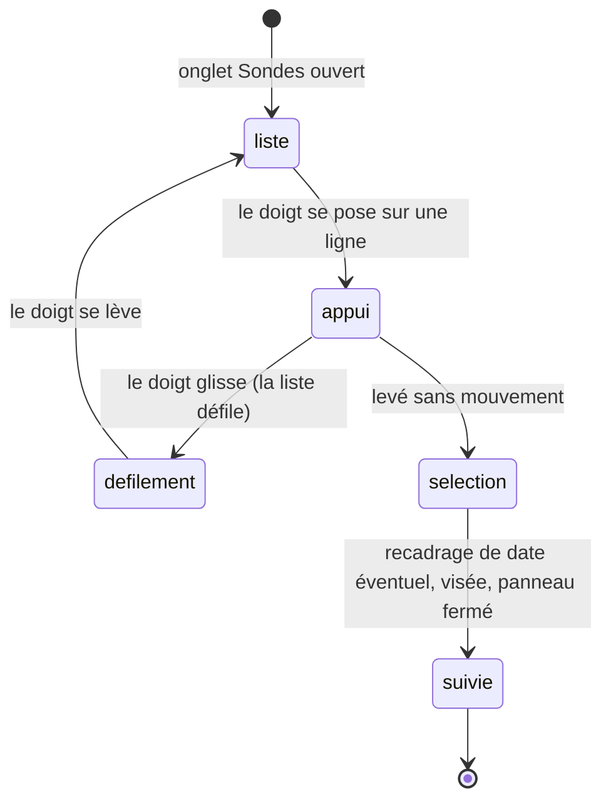

# La liste des sondes

## Résumé

L'onglet Sondes du [panneau Explorer](panneau.md) présente les 26 missions spatiales du jeu de données, en grille à deux colonnes, chacune avec son nom et sa période de validité, triées du départ le plus ancien au plus récent. Toucher une sonde la sélectionne : si la date simulée est hors de sa période, une transition de date l'y amène ; la caméra pivote vers la sonde ; le panneau se ferme. La sonde sélectionnée affiche alors sa trace — la trajectoire déjà parcourue — que la caméra cadre automatiquement, avec son étiquette. Sous la grille, la bascule « Afficher toutes les sondes » fait apparaître dans la scène toutes les sondes valides à la date courante, sans trace ni étiquette pour les non-sélectionnées.

## Le cas simple

L'utilisateur ouvre le panneau Explorer, onglet Sondes, et touche « Voyager 1 ». Le panneau se ferme. Si la date simulée est en dehors de 1977–2030, la date voyage en 0,95 seconde — vers aujourd'hui si aujourd'hui tombe dans la période, sinon vers la borne la plus proche (le départ réel de la mission, ou le 31 décembre de son année de fin). En même temps, la caméra pivote pour se placer face à la trajectoire, un peu au-dessus du plan des orbites, et recule jusqu'à cadrer toute la route parcourue : un arc lumineux de la couleur de la sonde, du départ de la Terre à la position courante, terminé par l'octaèdre lumineux de la sonde et son étiquette. Le cartouche affiche le nom et la période, et son texte explicatif une fois déplié.

Un pincement ne rapproche pas la caméra comme ailleurs : il règle l'*ampleur* du cadrage de la trace, de 0,3× (serré sur la sonde) à 3× (large autour de la route) — voir [le geste composé](../camera/geste-compose.md) et [Gestes et caméra](../foundations/gestes-et-camera.md).

### Les 26 sondes

La liste montre exactement ceci : le nom et la période, rien d'autre. La forme de la trajectoire — donc de la trace — dépend du type de route de chaque sonde :

| Type de trajectoire | Sondes | Trace affichée |
| --- | --- | --- |
| Route reconstituée (départ de la Terre, assistances gravitationnelles, échappement) | Voyager 1, Voyager 2, Pioneer 10, Pioneer 11, New Horizons, Cassini, Galileo, Ulysses, MESSENGER, BepiColombo, JUICE, Europa Clipper, Psyche, Hayabusa2, Hera, Dawn | Toute la route depuis le départ |
| Boucle héliocentrique périodique | Parker Solar Probe, Solar Orbiter, Lucy, Rosetta, OSIRIS-APEX | La dernière révolution seulement |
| Boucle locale autour d'un parent | Juno (Jupiter), Tianwen-1 (Mars), Mars Express (Mars), Akatsuki (Vénus), JWST (Terre) | La dernière révolution autour du parent |

Les périodes affichées vont de « 1972–2030 » (Pioneer 10) à « 2024–2034 » (Europa Clipper). Le jeu de données distingue des missions actives et historiques, mais la liste ne montre aucune différence entre elles.

## L'interaction, événement par événement

### Le doigt se pose

Sur une ligne de la grille : la ligne prend l'aspect enfoncé du bouton. Rien d'autre ne réagit : ni la scène, ni la date, ni la sélection.

### Levé sans mouvement

C'est ici que tout se joue — pour une ligne de liste, le tap *est* l'action. Dans l'ordre :

1. **Recadrage de date, si nécessaire.** Si la date simulée est déjà dans la période de la sonde, rien ne bouge. Sinon, une [transition de date](../foundations/temps-et-timeline.md) de 0,95 seconde démarre : vers aujourd'hui si aujourd'hui est dans la période ; sinon vers la borne la plus proche — la date de départ réelle de la mission si la date simulée est avant, le 31 décembre de l'année de fin si elle est après. La poignée est déposée à sa position de repos (62 %).
2. **Visée caméra.** L'azimut et l'élévation rejoignent par amortissement un angle calculé sur la position de la sonde à la date d'arrivée : la caméra se place de côté par rapport à la ligne Soleil–sonde, environ 24° au-dessus du plan. Le roulis n'est pas touché. Un geste d'orientation de l'utilisateur abandonne cette visée à tout moment.
3. **Sélection.** La sonde devient la sélection courante (elle remplace la précédente) ; le cartouche prend son nom et sa période ; le panneau Explorer se ferme.

> Note technique : l'azimut visé est perpendiculaire à la direction Soleil–sonde (un quart de tour d'écart), ce qui présente la route de profil plutôt que dans l'axe. La borne de fin visée par le recadrage est un jour avant le 1ᵉʳ janvier de l'année de fin + 1 — dans la période, avec un jour de marge.

### Le geste s'engage

Si le doigt glisse au lieu de se lever, c'est le défilement de la liste qui prend : la ligne ressort, aucune sélection n'aura lieu. Un glissement qui commence sur le panneau ne fait jamais orbiter la caméra.

### Pendant le geste

La liste suit le doigt. La scène continue de vivre derrière (élan de caméra, élan de timeline éventuels) — le panneau n'y touche pas.

### Le doigt se lève

Fin du défilement, avec l'inertie standard des listes. Rien n'est sélectionné.

### Après la sélection : la sonde suivie

Une fois la sonde sélectionnée, et tant qu'elle l'est :

- **La trace** — sa trajectoire parcourue, du départ (ou de sa dernière révolution si elle boucle) à la date simulée — est affichée en permanence, dans la couleur de la sonde, bien plus opaque que les traces de défilement. Elle se recalcule à chaque changement de date : reculer dans le temps la raccourcit, avancer l'allonge.
- **Le cadrage** suit la trace, pas la sonde : la caméra vise le centre de la boîte englobante de la trace et sa distance est recalculée en continu pour que la trace tienne dans l'écran (jamais plus près que 3), multipliée par l'ampleur choisie au pincement (0,3–3, remise à 1 à chaque changement de sélection).
- **L'étiquette** nommée suit la sonde à l'écran ; la sonde est dessinée un peu plus grosse que ses voisines et à taille d'écran à peu près constante quelle que soit la distance.

## Variantes

| Variante | Au début du geste | Pendant le geste |
| --- | --- | --- |
| Sélection courante | Toucher une autre sonde remplace la sélection (ampleur remise à 1, [bascule début/fin](../selection/cartouche.md) remise à « début »). Toucher la sonde déjà sélectionnée rejoue la sélection : recadrage de date éventuel, re-visée, fermeture du panneau — mais l'ampleur et la bascule début/fin sont conservées. | Sans objet — le défilement de la liste ne sélectionne rien. |
| Panneau Explorer ouvert | Précondition : la liste vit dans le panneau. La sélection le ferme ; le défilement le laisse ouvert. | Aucun effet. |
| Cartouche déplié | La sélection ne replie pas le cartouche : il affiche le texte de la nouvelle sonde, et le cadrage reste décalé vers la moitié haute (voir [le cartouche](../selection/cartouche.md)). | Aucun effet. |
| Échelle de temps choisie | Aucun effet sur la sélection elle-même ; le pas ne change que la fenêtre recalculée autour de la date d'arrivée du recadrage. | Aucun effet. |

## Annulation et interruption

| Événement | Au début du geste (doigt posé sur une ligne) | Pendant le geste / après la sélection |
| --- | --- | --- |
| Taper le vide | Impossible : le doigt est sur le panneau, pas sur la scène. | Après la sélection, taper le vide désélectionne tout : trace éteinte, étiquette éteinte, vue d'ensemble. |
| Un deuxième doigt se pose | Sur la scène : un geste composé peut commencer en parallèle, sans annuler l'appui sur la ligne. | Un geste d'orientation abandonne la visée en cours ; le cadrage de distance, lui, continue. |
| Une transition de date animée démarre | La sélection elle-même en démarre une le cas échéant ; une nouvelle transition (autre sélection, lien de date) remplace la précédente là où elle en est. | La transition du recadrage peut être arrêtée net en touchant la poignée : la date reste où elle est, la sonde peut alors être hors période (ligne suivante). |
| Le système annule le toucher | L'appui est annulé : pas de sélection, la ligne ressort. | La transition de date et la visée, déjà lancées, continuent — rien n'est annulé rétroactivement. |
| L'app passe en arrière-plan | Même chose : pas de sélection. Au retour, le panneau est tel quel. | Transition et visée se retrouvent terminées ou poursuivies au retour (elles courent sur l'horloge réelle). |
| La cible disparaît | Sans objet : les 26 lignes de la liste ne dépendent pas de la date — une sonde hors période reste listée et sélectionnable (le recadrage de date s'en charge). | Si la date quitte la période (glissement, élan), la sonde et sa trace disparaissent ; la sélection subsiste et la caméra revient, par mouvement amorti, à la vue d'ensemble — voir [Scène et objets](../foundations/scene-et-objets.md). Tout revient si la date rentre dans la période. |
| Le réseau manque | Aucun effet : les 26 sondes sont entièrement embarquées. | Aucun effet. |
| L'appareil pivote | La grille se recompose dans la nouvelle largeur. | Le cadrage de la trace est recalculé pour le nouveau format d'écran. |

## Interactions avec les autres systèmes

**Caméra et cadrage.** La sélection pose une visée d'orientation (amortie, abandonnée au premier geste d'orientation — constantes dans [Gestes et caméra](../foundations/gestes-et-camera.md)) et délègue la distance au cadrage automatique de la trace, recalculé à chaque image. Le pincement règle l'ampleur de ce cadrage (0,3–3) au lieu de la distance — voir [le geste composé](../camera/geste-compose.md).

**Temps simulé.** Ce document possède le recadrage de date à la sélection d'une sonde : période respectée, aujourd'hui préféré, borne la plus proche sinon, transition de 0,95 s ([Temps et timeline](../foundations/temps-et-timeline.md)). La trace suit ensuite la date en continu. La bascule début/fin de mission — taper l'en-tête du cartouche d'une sonde pour sauter à son départ puis à sa fin — appartient au [cartouche](../selection/cartouche.md).

**Sélection.** Sélectionner une sonde remplace la sélection courante et ferme le panneau. Les sondes rendues visibles par « Afficher toutes les sondes » sont aussi sélectionnables au tap dans la scène — priorités et rayons dans [Toucher un astre](../selection/toucher-un-astre.md).

**Réseau et replis.** Aucune interaction : routes, orbites et périodes sont embarquées.

**Échelles compressées.** Les routes sont dessinées dans l'espace compressé : directions exactes, distances resserrées ([Scène et objets](../foundations/scene-et-objets.md)). Les sorties du plan de l'écliptique (Ulysses au-dessus des pôles du Soleil, les Voyager après leur dernière assistance) sont visibles telles quelles.

**Localisation et langue.** Les noms de sondes sont des noms propres, non traduits ; les périodes sont des années en chiffres. Aucun texte de la liste ne dépend de la région.

**Accessibilité.** Les lignes sont des boutons et la bascule un interrupteur SwiftUI standard : VoiceOver peut les lire et les activer. Rien de spécifique n'est prévu au-delà ; la trace et le cadrage n'ont pas d'équivalent non visuel.

## Cas limites

- **La période de validité court de la date de départ réelle** (pas du 1ᵉʳ janvier de l'année de départ) **au tout début de l'année de fin + 1** : avant son départ décimal (septembre 1977 pour Voyager 1), la sonde n'existe pas, même pendant l'année affichée.
- **Sélectionner une sonde historique aujourd'hui** (Cassini, « 1997–2017 ») : aujourd'hui est après la période, la date voyage vers le 31 décembre 2017 — jamais vers aujourd'hui.
- **« Afficher toutes les sondes » ne montre que les sondes valides à la date courante** : en 1980, seuls les Pioneer et les Voyager apparaissent. Les sondes apparaissent et disparaissent au fil du défilement du temps. Les non-sélectionnées n'ont ni trace, ni étiquette, et sont dessinées à taille normale.
- **La bascule n'est pas mémorisée** : elle repart désactivée à chaque lancement de l'app.
- **Toucher la poignée pendant le recadrage de date** l'arrête net : la sonde est sélectionnée mais peut être invisible (date hors période), caméra en vue d'ensemble, jusqu'à ce qu'on ramène la date dans la période.
- **Les sondes qui bouclent** (héliocentriques et locales) ne montrent jamais leur route d'approche : Juno sélectionnée montre sa dernière révolution autour de Jupiter, pas son voyage Terre–Jupiter.
- **Reculer la date jusqu'au départ d'une sonde à route** raccourcit sa trace jusqu'à un point ; le cadrage se resserre en continu (jamais sous 3 de distance).
- **La trace s'arrête à la fin de la période** même si la route du jeu de données continue au-delà (les Voyager ont des points de route jusqu'en 2032, la trace s'arrête au 1ᵉʳ janvier 2031).

## Questions ouvertes et vérification

- La borne exacte de disparition : d'après le code, une sonde « 1977–2030 » n'est valide que jusqu'au tout premier instant de 2031 (année décimale ≤ année de fin + 1), alors que [Scène et objets](../foundations/scene-et-objets.md) donne en exemple une disparition « au 1ᵉʳ janvier 2032 ». À trancher sur l'app et à réconcilier entre les deux documents ; possible sujet de triage.
- La visée d'azimut perpendiculaire à la ligne Soleil–sonde (et non dans son axe) est lue dans le code ; l'effet à l'œil — la route présentée de profil — est à confirmer sur l'app.
- Le champ actif/historique du jeu de données n'a aucun effet visible dans la liste ni dans la scène (seule la couleur distingue les sondes) ; à confirmer comme choix assumé.
- La fermeture du panneau à la sélection est déclenchée sans animation explicite dans le code ; savoir si elle est animée ou instantanée à l'œil reste à vérifier.
- Le retour amorti à la vue d'ensemble quand la sonde suivie sort de sa période est déduit du code (mêmes amortissements que toute visée) ; l'effet ressenti est à vérifier — question déjà ouverte dans [Scène et objets](../foundations/scene-et-objets.md).
- L'ordre de tri de la grille entre deux sondes au départ identique (Solar Orbiter et Tianwen-1, toutes deux 2020) n'est pas garanti par le code ; l'ordre observé est à noter à la vérification.

Vérifié contre le dossier natif au commit `ddd8314`.
