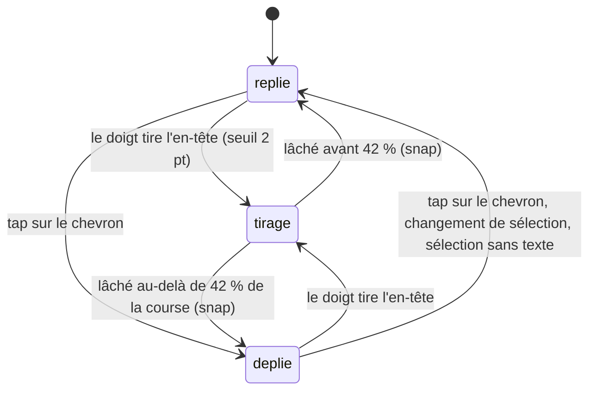

# Le cartouche

## Résumé

Le cartouche est la feuille au centre du dock : replié, il nomme la sélection courante ; déplié, il en raconte l'histoire. On le déplie en le tirant vers le haut, au chevron, ou par l'action d'accessibilité ; la scène se recadre en même temps pour que l'astre reste visible au-dessus. Le texte contient des *liens de date* qui calent la timeline, et, pour une sonde, l'en-tête du cartouche fait basculer la date entre le début et la fin de la mission. Le cartouche existe toujours ; il n'est dépliable que si la sélection a un texte.

## Le cas simple

Neptune est sélectionnée. Le cartouche affiche « Neptune — 30,07 UA du Soleil », avec une petite poignée-pastille et un chevron. L'utilisateur tire la feuille vers le haut : elle suit le doigt, le texte apparaît en fondu, les deux boutons ronds du dock s'estompent, et Neptune remonte dans la moitié haute de l'écran. Il lâche au-delà de la mi-course : la feuille s'ouvre en grand — la moitié de l'écran — et le texte se lit, défilable.

Dans le texte, « janvier 1986 » est souligné : il le touche, et la scène voyage jusqu'à janvier 1986 pendant que la feuille reste ouverte. Un tap sur le chevron (tourné vers le bas) replie la feuille ; tout redevient comme avant, scène recentrée.

## L'interaction, événement par événement

Le geste raconté est le tirage de la feuille ; le chevron et les liens sont des taps simples décrits dans leurs phases.

### Le doigt se pose

Sur l'en-tête de la feuille (la bande de 58 points qui porte titre et sous-titre) : rien ne se passe au contact. Le tirage ne concernera que la feuille — jamais la scène derrière.

### Levé sans mouvement

Un tap sur l'en-tête (hors chevron) : si la sélection est une sonde, c'est la **bascule début/fin** — la date part en transition vers le début de la mission (première fois), puis vers la fin (tap suivant), et ainsi de suite ; la poignée de timeline se place tout en haut (début) ou tout en bas (fin) de sa course. Pour toute autre sélection, le tap sur l'en-tête ne fait rien.

Un tap sur le chevron : la feuille s'ouvre ou se ferme entièrement, en un ressort d'un tiers de seconde. Le chevron pivote de 180° pour pointer dans le sens de la fermeture.

Un tap sur un lien de date (feuille ouverte) : transition de date vers le jour désigné — une date complète va à ce jour, un mois seul au 15 du mois, une année seule au 1ᵉʳ juillet. La feuille reste ouverte.

### Le geste s'engage

Dès deux points de déplacement vertical, la feuille suit le doigt. La hauteur au moment du contact sert de référence ; la feuille est bornée entre sa hauteur repliée (58 points) et sa hauteur dépliée (la moitié de l'écran). Pendant le tirage, le texte ne réagit pas au toucher (pas de défilement simultané), et le recadrage de la scène suit la feuille en direct, proportionnellement à son ouverture.

### Pendant le geste

La feuille colle au doigt. Trois choses varient continûment avec son ouverture : l'opacité du texte (fondu), l'estompage et le rétrécissement des deux boutons ronds du dock (intouchables dès 8 % d'ouverture), et le décalage de visée de la caméra ([Gestes et caméra](../foundations/gestes-et-camera.md) le possède). La largeur de la feuille grandit aussi, de la largeur du cartouche replié à toute la largeur disponible.

### Le doigt se lève

La feuille rejoint l'état que la vitesse du geste désigne : la position *projetée* du geste (là où il serait arrivé sur son élan) est comparée à 42 % de la course — au-delà, la feuille s'ouvre en grand ; en deçà, elle se replie. Un petit geste vif suffit donc à ouvrir ou fermer ; un tirage lent se décide à la position réelle. Le ressort dure un tiers de seconde, sans rebond. Rien n'est enregistré : l'état ouvert/fermé n'est pas persisté entre les sélections.

## Variantes

| Variante | Au début du geste | Pendant le geste |
| --- | --- | --- |
| Sélection courante | Détermine le contenu (titre, sous-titre, texte) et si la feuille est dépliable (il faut un texte). Une sonde ajoute la bascule début/fin au tap sur l'en-tête. | Un changement de sélection (impossible au doigt, possible par disparition du texte) replie la feuille. |
| Panneau Explorer ouvert | Aucun effet : la feuille se tire par-dessus. | Aucun effet. |
| Cartouche déplié | C'est l'état de départ : on tire vers le bas pour fermer, mêmes seuils. | Sans objet. |
| Échelle de temps choisie | Aucun effet sur la feuille ; les liens de date déposent la poignée à sa position de repos quel que soit le pas. | Aucun effet. |

Changer de sélection — par un tap sur la scène ou depuis une liste — replie toujours la feuille, immédiatement.

## Annulation et interruption

| Événement | Feuille repliée / au tap | Pendant le tirage |
| --- | --- | --- |
| Taper le vide | Désélection : le cartouche redevient « Système solaire — Explorer les orbites », sans texte, donc replié et non dépliable. | Impossible pendant le tirage (le doigt est sur la feuille). |
| Un deuxième doigt se pose | Sans effet : la feuille se manipule à un doigt, le second est ignoré. | Ignoré ; le tirage continue avec le premier doigt. |
| Une transition de date démarre | Les liens de date et la bascule début/fin en déclenchent une ; la feuille reste ouverte pendant le voyage. | Impossible : les déclencheurs sont des taps, indisponibles pendant le tirage. |
| Le système annule le toucher | Rien n'était en cours. | Le tirage s'arrête et la feuille snappe depuis sa position courante (mêmes 42 %). |
| L'app passe en arrière-plan | L'état replié/déplié est conservé tel quel. | Comme l'annulation : snap depuis la position courante au retour. |
| La cible disparaît | La sélection — donc le texte — subsiste (voir [Scène et objets](../foundations/scene-et-objets.md)) : la feuille reste dépliable et ouverte si elle l'était. Si la sélection perd son texte, la feuille se replie d'elle-même. | Idem ; le tirage n'est pas interrompu par la disparition de l'astre dans la scène. |
| Le réseau manque | Aucun effet : titres et textes sont embarqués. Seul le texte d'un lancement peut venir du réseau ([explorer/lancements.md](../explorer/lancements.md)). | Aucun effet. |
| L'appareil pivote | La hauteur dépliée suit la nouvelle hauteur d'écran ; une feuille ouverte s'ajuste en ressort. | Le tirage continue avec les nouvelles bornes. |

Après toute interruption, la feuille est soit ouverte soit fermée — jamais entre les deux : le snap tranche toujours.

## Interactions avec les autres systèmes

**Caméra et cadrage.** L'ouverture de la feuille décale la visée pour garder l'astre dans la moitié haute ; le décalage suit le doigt pendant le tirage et s'amortit au snap. Sans sélection, pas de décalage. [Gestes et caméra](../foundations/gestes-et-camera.md) possède le mécanisme.

**Temps simulé.** Les liens de date et la bascule début/fin déclenchent des transitions de date ([Temps et timeline](../foundations/temps-et-timeline.md)). La bascule place la poignée en butée (haut pour le début, bas pour la fin), contrairement à tous les autres déclencheurs qui la déposent au repos à 62 %.

**Sélection.** La feuille reflète la sélection et se replie à chaque changement. Elle ne peut pas la modifier — sauf indirectement : rien depuis la feuille ne désélectionne.

**Réseau et replis.** Les textes des astres sont embarqués ; seuls les descriptifs de lancements peuvent venir de l'API.

**Échelles compressées.** Aucune interaction.

**Localisation et langue.** Textes et dates en français ; la reconnaissance des liens de date comprend les mois français et l'ordinal « 1ᵉʳ ».

**Accessibilité.** La feuille expose une action nommée « Agrandir le détail » / « Réduire le détail » ; le texte est masqué aux technologies d'assistance tant que la feuille est majoritairement fermée, comme les boutons du dock quand elle est majoritairement ouverte.

## Cas limites

- **Sélection sans texte** : la feuille n'a ni pastille ni chevron, ne se tire pas, et le tap sur l'en-tête ne fait rien (sauf sonde — mais toute sonde a un texte).
- **Basculer début/fin à répétition** : chaque tap repart en transition vers l'autre borne, même si la précédente n'est pas finie. Changer de sonde remet la bascule sur « début ».
- **Un lien de date vers une date où la sonde sélectionnée n'existe pas** (le texte de Voyager mentionne 1977, on peut y aller depuis une date où la sonde a déjà quitté cette région) : le voyage a lieu ; la visibilité suit les règles de [Scène et objets](../foundations/scene-et-objets.md).
- **Années hors liens** : seules les années 1900–2099 sont reconnues comme liens ; « 88 jours » ou un nombre isolé ne sont pas des liens.
- **Tirer pendant que le texte défile** : le tirage a priorité dès son seuil de deux points ; le défilement du texte demande un geste qui démarre dans le texte, pas dans l'en-tête.
- **Le sous-titre d'un satellite change pendant que la feuille est ouverte** (altitude recalculée, sortie de fenêtre SGP4) : le texte de l'en-tête se met à jour en place, la feuille ne bouge pas.

## Questions ouvertes et vérification

- Le seuil de snap à 42 % et l'usage de la position projetée (l'élan compte) sont lus dans le code ; le ressenti — « un petit geste vif suffit » — est à confirmer sur appareil.
- La bascule début/fin au tap sur l'en-tête n'est signalée par aucun indice visuel : rien ne dit qu'un tap sur le titre d'une sonde déplace la date. Découvrabilité douteuse — peut mériter un ticket produit plutôt qu'une simple documentation.
- Le tap sur l'en-tête d'une sonde déclenche la bascule même quand la feuille est ouverte ; le même tap au même endroit sert aussi à saisir le tirage. La cohabitation exacte (tap court vs. début de tirage) repose sur le seuil de deux points, à vérifier à la main.
- La reconnaissance des dates est faite au rendu du texte ; un texte de lancement venu de l'API (en anglais) n'aura pratiquement jamais de liens de date reconnus (mois français uniquement). Comportement attendu, non vérifié.

Vérifié contre le dossier natif au commit `ddd8314`.
