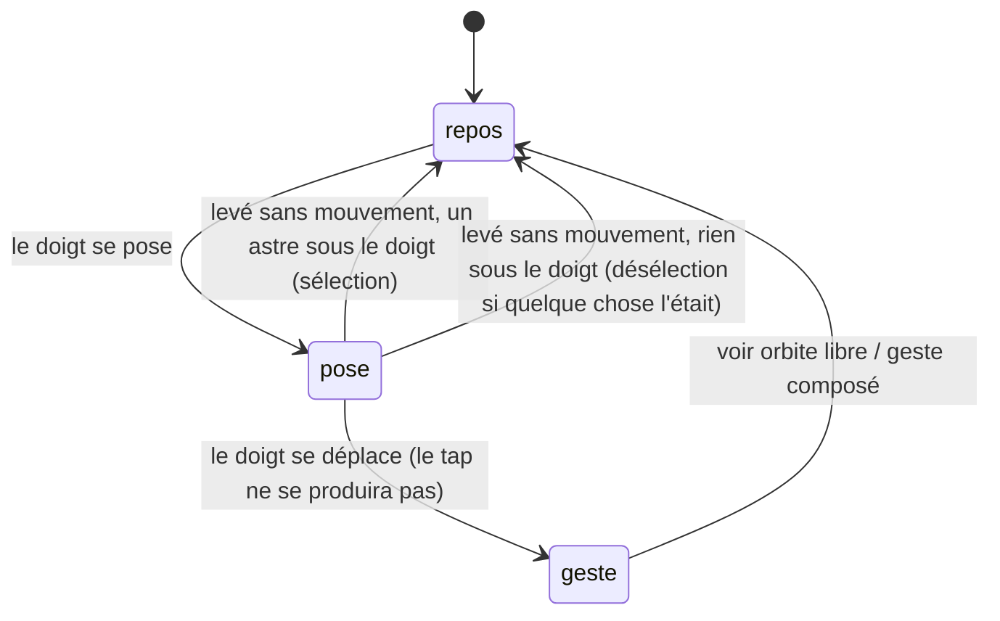

# Toucher un astre

## Résumé

Un tap sur la scène sélectionne l'astre touché : la caméra s'en approche, le cartouche prend son nom, et ce qui dépend de lui (lunes, trace, étiquette) apparaît. Un tap dans le vide désélectionne tout et rend la vue d'ensemble. Le tap est disponible partout et tout le temps, mais uniquement au repos : il ne se déclenche jamais pendant un glissement, un pincement ou une torsion, ni sur les éléments d'interface posés sur la scène.

## Le cas simple

L'utilisateur touche Saturne. La caméra glisse vers elle et s'en approche ; ses sept lunes apparaissent avec leurs orbites ; le cartouche en bas affiche « Saturne — 9,54 UA du Soleil » avec un chevron pour déplier le texte explicatif. L'angle de vue ne change pas : la caméra vient à la planète par le chemin le plus direct, sans tourner autour.

Il touche ensuite Titan, une des lunes : la sélection passe à Titan, la caméra s'approche encore (les lunes se sélectionnent de près), le cartouche suit. Puis il touche le fond étoilé : tout se désélectionne, les lunes disparaissent, la caméra recule jusqu'à la vue d'ensemble, le cartouche redevient « Système solaire — Explorer les orbites ».

## L'interaction, événement par événement

### Le doigt se pose

Rien ne se passe au contact : pas de surbrillance, pas de retour visuel. Tout se décide au lever.

### Levé sans mouvement

C'est le tap entier — ce geste n'a pas de phase étendue. Au lever, l'app cherche ce qui est sous le doigt :

- **Sont candidats** : les lunes actuellement visibles, les sondes visibles, les satellites individuels visibles, et les huit planètes. Jamais : les constellations (le nuage GPS ou Starlink n'est pas touchable point par point), le Soleil, le point de géolocalisation, une trajectoire de lancement, une orbite, une trace, une étiquette.
- **Chaque candidat a un rayon de saisie** projeté à l'écran, jamais inférieur à 22 points — un petit corps reste touchable de loin. Le doigt doit tomber dans ce rayon.
- **En cas de chevauchement, la priorité tranche** : lune d'abord, puis sonde ou satellite, puis planète ; à priorité égale, le candidat dont le centre est le plus proche du doigt. On peut donc toucher Titan devant Saturne, ou une sonde devant la planète qu'elle survole.

Si un astre est trouvé et qu'il n'est pas déjà sélectionné, il devient la sélection (voir « Le doigt se lève » ci-dessous pour ce que ça déclenche). **Retoucher l'astre déjà sélectionné ne fait rien** — ni désélection, ni rebond de caméra.

Si rien n'est trouvé et que quelque chose était sélectionné — un astre ou un lancement —, tout est désélectionné : retour à la vue d'ensemble, roulis remis à zéro, caméra ramenée au centre à distance 230. Si rien n'était sélectionné, le tap dans le vide ne fait rien du tout.

### Le geste s'engage

Sans objet : si le doigt se déplace, ce n'est plus un tap — c'est l'[orbite libre](../camera/orbite-libre.md) qui prend le geste, et aucune sélection n'aura lieu à ce lever-là.

### Pendant le geste

Sans objet.

### Le doigt se lève

La sélection prend effet immédiatement, en un seul événement :

- le cartouche affiche le nom de l'astre et son sous-titre (distance au Soleil pour une planète, « Lune de {planète} » pour une lune, période de validité pour une sonde, altitude et inclinaison pour un satellite), et son texte explicatif devient dépliable ;
- la caméra amorce son approche vers la distance d'arrivée du type ([Scène et objets](../foundations/scene-et-objets.md) donne le tableau) — sans changer d'angle : le tap n'oriente jamais la caméra, contrairement à la sélection depuis une liste ;
- ce qui dépend de la sélection apparaît : les lunes du système sélectionné, la trace et l'étiquette d'une sonde, l'orbite et l'étiquette d'un satellite individuel ;
- si l'astre remplacé était une sonde, sa trace et son étiquette s'éteignent ; la bascule début/fin du cartouche revient à « début ».

Rien n'est enregistré au-delà de l'état courant : pas d'historique de sélection, pas d'annulation — pour revenir, on retouche l'astre précédent.

> Note technique : sélectionner une sonde par tap ferme le panneau Explorer s'il était ouvert, comme la sélection depuis la liste. La sélection d'une planète, d'une lune ou d'un satellite par tap le laisse ouvert.

## Variantes

| Variante | Au moment du tap | Pendant le geste |
| --- | --- | --- |
| Sélection courante | Détermine ce qui est touchable (les lunes du système sélectionné, la trace visible) et ce qu'un tap dans le vide désélectionne. Retoucher la sélection courante ne fait rien. | Sans objet — le tap n'a pas de durée. |
| Panneau Explorer ouvert | Le tap fonctionne sur la partie visible de la scène. Sélectionner une sonde ferme le panneau ; le reste le laisse ouvert. Un tap dans le vide désélectionne mais ne ferme pas le panneau. | Sans objet. |
| Cartouche déplié | Le tap fonctionne sur la scène restante ; changer de sélection replie le cartouche. | Sans objet. |
| Échelle de temps choisie | Aucun effet. | Sans objet. |

## Annulation et interruption

| Événement | Avant le lever (doigt posé) | Pendant le geste |
| --- | --- | --- |
| Taper le vide | C'est l'une des deux issues du tap lui-même : désélection totale. | Sans objet — pas de phase étendue. |
| Un deuxième doigt se pose | Le tap n'aura pas lieu : le geste composé prend la main. Aucune sélection ne change. | Sans objet. |
| Une transition de date démarre | Impossible doigt posé (elle vient d'un bouton ou d'une liste). | Sans objet. |
| Le système annule le toucher | Le tap n'aura pas lieu ; rien ne change. | Sans objet. |
| L'app passe en arrière-plan | Même chose : aucun tap, aucun changement. | Sans objet. |
| La cible disparaît | Un astre disparu n'est plus candidat : le toucher là où il était est un tap dans le vide. La sélection *conservée* d'une sonde invisible (voir [Scène et objets](../foundations/scene-et-objets.md)) se désélectionne donc d'un tap n'importe où dans le vide. | Sans objet. |
| Le réseau manque | Aucun effet — les rayons de saisie et priorités sont locaux. Un satellite sans TLE chargés n'est pas touchable (il n'est pas visible). | Sans objet. |
| L'appareil pivote | Aucun effet particulier ; les rayons de saisie suivent la projection courante. | Sans objet. |

Après toute interruption, la sélection est exactement ce qu'elle était : le tap est atomique, il n'a pas d'état partiel.

## Interactions avec les autres systèmes

**Caméra et cadrage.** Le tap impose la distance d'arrivée du type sélectionné et, dans le vide, la vue d'ensemble complète (angle, roulis, distance). Il n'oriente jamais la caméra. Les amortissements sont dans [Gestes et caméra](../foundations/gestes-et-camera.md).

**Temps simulé.** Le tap ne touche jamais à la date — c'est la différence principale avec la sélection d'une sonde depuis la liste, qui peut déclencher une transition de date ([explorer/sondes.md](../explorer/sondes.md)).

**Sélection.** Ce document la possède, avec les priorités et les rayons de saisie.

**Réseau et replis.** Indirect seulement : ce qui n'est pas chargé n'est pas visible, donc pas touchable.

**Échelles compressées.** Les rayons de saisie sont projetés depuis l'espace compressé ; le minimum de 22 points garantit qu'aucun corps visible n'est trop petit pour être touché.

**Localisation et langue.** Les sous-titres du cartouche sont en français, nombres localisés (« 9,54 UA »).

**Accessibilité.** La scène n'expose pas ses astres comme éléments d'accessibilité ; la sélection au tap n'a pas d'équivalent VoiceOver. Les listes du panneau Explorer sont l'alternative accessible.

## Cas limites

- **Deux astres exactement superposés** (une sonde passant devant sa planète parente) : la priorité tranche, le plus prioritaire gagne même s'il est plus loin du doigt que l'autre.
- **Un astre derrière la caméra** n'est jamais candidat, même si sa projection mathématique retomberait dans l'écran.
- **Toucher une constellation** : le nuage n'est pas touchable ; le tap traverse et touche ce qu'il y a derrière (souvent la Terre — les nuages l'entourent).
- **Toucher pendant l'élan de la caméra** : l'élan continue pendant la sélection ; le tap ne l'arrête pas (seul un nouveau glissement le ferait).
- **Toucher un astre pendant qu'un lancement est sélectionné** : la sélection d'astre change, mais le lancement reste sélectionné et la caméra reste cadrée sur sa trajectoire — voir [explorer/lancements.md](../explorer/lancements.md), c'est un cas limite documenté là.
- **Tap dans le vide sans aucune sélection** : strictement rien — pas même une remise à zéro du roulis.

## Questions ouvertes et vérification

- Le rayon de saisie effectif des sondes varie avec leur taille apparente à l'écran ; la formule du code est compliquée et son résultat aux distances extrêmes (très dézoomé) n'a pas été vérifié à la main.
- « Retoucher l'astre sélectionné ne fait rien » est lu dans le code (la sélection ne change que si elle diffère) ; à confirmer qu'aucun effet secondaire visible ne se produit.
- Le tap qui traverse une constellation n'a pas été vérifié sur appareil.

Vérifié contre le dossier natif au commit `ddd8314`.
