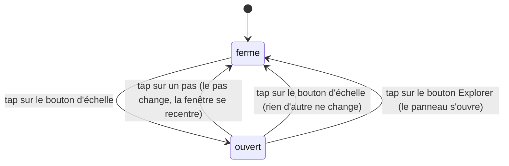
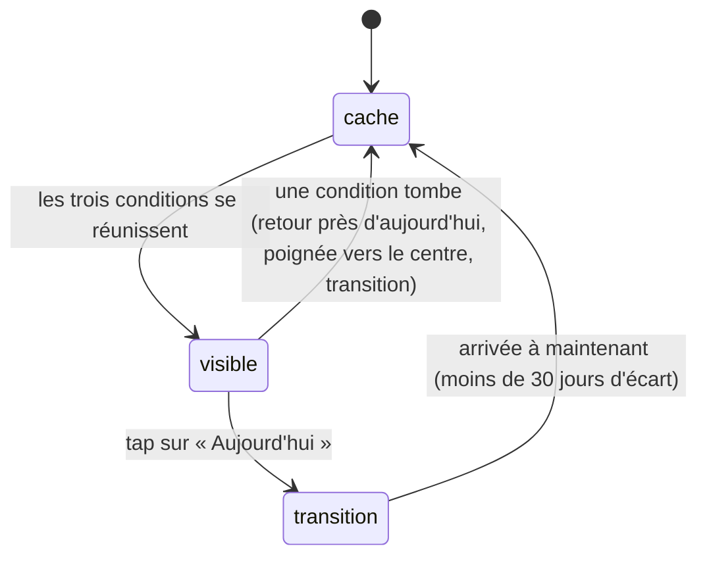

# Le menu d'échelle et le bouton « Aujourd'hui »

## Résumé

Deux commandes à un seul tap encadrent la timeline. Le bouton de droite du dock ouvre le menu d'échelle — Heure, Jour, Mois, Année — qui fixe le pas de la timeline : choisir un pas change la fenêtre de temps sans toucher à la date simulée, replace la poignée à 62 % de sa course et referme le menu. Le bouton « Aujourd'hui », flottant à mi-hauteur du bord droit, ramène la date simulée à maintenant par une transition de date ; il n'apparaît que lorsque la date s'écarte franchement d'aujourd'hui et que la poignée n'est pas près du centre de sa course. Ni l'un ni l'autre ne touche à la sélection, à la caméra ou au réseau.

## Le cas simple

L'utilisateur touche le bouton de droite du dock — une pastille ronde qui affiche la lettre du pas courant (« J » au lancement, pour Jour). Le menu se déploie juste au-dessus, aligné à droite : quatre lignes, Heure, Jour, Mois, Année, celle du pas courant surlignée en clair. Il touche « Année » : le menu se referme aussitôt, la pastille affiche « A », la date dans la poignée passe au format mois-année — mais la date elle-même n'a pas bougé. Seule l'étendue que représente la course de la poignée a changé ; la poignée s'est replacée à 62 % de sa hauteur, prête à glisser.

Plus tard, après avoir fait défiler le temps loin dans le passé, il remarque un petit bouton « Aujourd'hui » à mi-hauteur du bord droit. Il le touche : le bouton disparaît et la scène revient à maintenant en un peu moins d'une seconde, planètes filant en sens inverse, la poignée déposée à 62 %. Le bouton ne réapparaît pas : la date est revenue à moins de 30 jours d'aujourd'hui.

## L'interaction, événement par événement

Ce sont deux taps simples sur des boutons ; les phases étendues du squelette (engagement, suivi continu du doigt) sont pour l'essentiel sans objet, comme indiqué ci-dessous.

### Le menu d'échelle

- **Le doigt se pose** sur le bouton d'échelle : la pastille se comprime légèrement (retour visuel d'appui). Rien d'autre ne se passe — le menu ne s'ouvre pas encore.
- **Levé sans mouvement** : c'est le tap ; le menu bascule (s'ouvre s'il était fermé, se ferme s'il était ouvert) en 0,16 s, surgissant depuis le coin bas-droit. Ouvert, la pastille s'inverse (fond clair, lettre sombre).
- **Le geste s'engage / pendant le geste** : sans objet. Glisser le doigt hors du bouton avant de le lever annule le tap ; il n'y a pas de phase continue.
- **Le doigt se lève** sur une ligne du menu : le pas est appliqué immédiatement — la fenêtre de temps prend l'étendue du pas choisi (voir [Temps et timeline](../foundations/temps-et-timeline.md#la-fenêtre-la-poignée-et-le-pas)) et se recentre autour de la date courante de sorte que la poignée se retrouve à 62 % de sa course, **sans changer la date simulée**. Le format de la date dans la poignée s'adapte au nouveau pas. Toute transition de date, tout élan et tout défilement au bord en cours sont annulés net. Le menu se referme dans le même geste.

Choisir la ligne déjà active fait tout cela aussi : même pas, mais la fenêtre se recentre et la poignée revient à 62 %.

> Note technique : le replacement de la poignée à 62 % est instantané, sans animation — c'est la fenêtre qui est recalculée autour de la date, pas la date qui bouge. La constante (62 %, `HANDLE_REST`) appartient aux [fondations](../foundations/temps-et-timeline.md).

### Le bouton « Aujourd'hui »

Le bouton n'existe que si trois conditions sont réunies en même temps : la date simulée s'écarte de plus de 30 jours d'aujourd'hui, la poignée est à plus de 9 points de pourcentage du centre de sa course, et aucune transition de date n'est en cours (les seuils appartiennent aux [fondations](../foundations/temps-et-timeline.md#ce-qui-dépend-de-la-date-au-delà-des-positions)). Il peut donc apparaître en plein glissement de poignée, dès que le défilement franchit la barre des 30 jours, et disparaître de même.

- **Le doigt se pose** : le bouton s'assombrit légèrement (retour d'appui standard). Rien d'autre.
- **Levé sans mouvement** : c'est le tap ; une transition de date de 0,95 s démarre vers maintenant, avec accélération puis décélération. Le bouton disparaît immédiatement — une transition en cours est l'une des conditions d'invisibilité. La fenêtre est recalculée autour de la date d'arrivée pour que la poignée soit déposée à 62 % de sa course. L'élan et le défilement au bord éventuels sont annulés.
- **Le geste s'engage / pendant le geste** : sans objet ; pas de phase continue.
- **Le doigt se lève** hors du bouton après avoir glissé : rien ne se déclenche.

À l'arrivée, la date est exactement maintenant : à moins de 30 jours d'aujourd'hui, le bouton reste caché. Toucher la poignée pendant la transition l'arrête net à la date atteinte — voir [le glissement](glissement.md).

> Note technique : les trois conditions ne sont pas évaluées au même endroit — l'écart de 30 jours et l'absence de transition sont réévalués à chaque image par la boucle de rendu, la position de la poignée par l'interface. Le résultat visible est le même : le bouton apparaît et disparaît au fil du glissement, sans délai perceptible.

## Variantes

| Variante | Au début du geste | Pendant le geste |
| --- | --- | --- |
| Sélection courante | Aucun effet sur les deux commandes. Pendant la transition d'« Aujourd'hui », l'astre sélectionné reste verrouillé dans le cadre tandis qu'il se déplace sur son orbite ; une sonde dont la période exclut aujourd'hui disparaît de la scène à l'arrivée en restant sélectionnée (voir [Scène et objets](../foundations/scene-et-objets.md)). | Sans objet — un tap n'a pas de phase continue. |
| Panneau Explorer ouvert | Le menu d'échelle s'ouvre par-dessus, panneau toujours ouvert : les deux sont visibles en même temps, le menu posé au-dessus du panneau. En sens inverse, ouvrir ou fermer le panneau par le bouton Explorer referme le menu. « Aujourd'hui » fonctionne normalement, panneau ouvert ou non. | Sans objet. |
| Cartouche déplié | Les deux boutons du dock s'estompent et deviennent intouchables : impossible d'ouvrir le menu d'échelle. Un menu déjà ouvert reste ouvert et ses lignes restent touchables — seul le bouton qui l'a ouvert est hors d'atteinte. « Aujourd'hui », hors du dock, reste touchable. | Sans objet. |
| Échelle de temps choisie | Le pas courant détermine la ligne surlignée du menu et la lettre de la pastille. Pour « Aujourd'hui », le pas ne change pas la durée de la transition (0,95 s quelle que soit la distance) ; il détermine la fenêtre recalculée à l'arrivée et le format de la date affichée. | Sans objet. |

## Annulation et interruption

| Événement | Au début du geste | Pendant le geste |
| --- | --- | --- |
| Taper le vide | La désélection ne touche ni au menu ni au bouton : un menu ouvert **reste ouvert** (taper la scène ne le ferme pas), « Aujourd'hui » reste visible si ses conditions tiennent. | Sans objet — un tap n'a pas de phase continue. |
| Un deuxième doigt se pose | Sans objet : ces boutons se manipulent à un doigt ; un deuxième doigt sur la scène y démarre le geste composé sans effet sur eux. | Sans objet. |
| Une transition de date démarre | Elle fait disparaître « Aujourd'hui » aussitôt. Le menu, lui, reste ouvert ; choisir un pas pendant la transition l'arrête net à la date atteinte. | Sans objet. |
| Le système annule le toucher | Le doigt était posé sans avoir levé : le tap ne se déclenche pas, rien ne change. | Sans objet. |
| L'app passe en arrière-plan | L'état est conservé tel quel : menu ouvert au départ, ouvert au retour ; les conditions d'« Aujourd'hui » sont réévaluées en continu au retour. Une transition lancée avant le passage court sur l'horloge réelle (voir [Temps et timeline](../foundations/temps-et-timeline.md#annulation-et-interruption)). | Sans objet. |
| La cible disparaît | Aucun effet sur ces commandes ; c'est au contraire la transition d'« Aujourd'hui » qui peut faire disparaître une sonde hors période (voir Variantes). | Sans objet. |
| Le réseau manque | Aucun effet : pas, fenêtre et transition sont entièrement locaux. | Sans objet. |
| L'appareil pivote | Le menu reste ouvert et suit le dock ; « Aujourd'hui » suit le bord droit. La course de la poignée change de longueur mais sa position relative est conservée : les conditions d'affichage ne bougent pas. | Sans objet. |

## Interactions avec les autres systèmes

**Caméra et cadrage.** Aucune des deux commandes ne pilote la caméra. Pendant la transition d'« Aujourd'hui », la caméra suit simplement sa cible qui se déplace avec le temps ; un geste d'orientation reste possible pendant toute la transition.

**Temps simulé.** C'est leur domaine. Le menu d'échelle fixe le pas — fenêtre, plafond d'élan, format de date — sans jamais déplacer la date. « Aujourd'hui » est l'un des quatre déclencheurs de transition de date recensés dans [Temps et timeline](../foundations/temps-et-timeline.md#la-date-simulée). Les deux annulent l'élan et le défilement au bord.

**Sélection.** Aucune des deux commandes ne lit ni n'écrit la sélection.

**Réseau et replis.** Aucune interaction.

**Échelles compressées.** Aucune interaction directe : le pas est une échelle de *temps*, pas d'espace — changer de pas ne modifie ni les distances de la scène ni leur compression.

**Localisation et langue.** Les libellés (Heure, Jour, Mois, Année, « Aujourd'hui ») et le format de date de la poignée sont en français, quelle que soit la langue de l'appareil.

**Accessibilité.** Les deux boutons du dock, les lignes du menu et « Aujourd'hui » sont des boutons standard, lus par VoiceOver avec leur libellé. Quand le cartouche est déplié, les boutons du dock sont aussi masqués à VoiceOver.

## Cas limites

- **Re-choisir le pas courant** n'est pas un geste vide : la fenêtre se recentre autour de la date et la poignée revient à 62 %. C'est un moyen de « ranger » la poignée sans changer ni de pas ni de date.
- **Menu ouvert, puis tap sur la scène** : le tap agit sur la scène (sélection ou désélection) et le menu reste ouvert. Il n'y a que trois façons de le fermer : choisir un pas, retoucher le bouton d'échelle, ou toucher le bouton Explorer.
- **« Aujourd'hui » à 31 jours comme à 40 ans** : la transition dure 0,95 s dans les deux cas — la vitesse apparente du temps varie énormément, pas la durée.
- **Le seuil des 9 points de pourcentage** évite que le bouton, posé à mi-hauteur du bord droit, ne se superpose à la poignée quand elle passe près du centre de sa course. Comme toute transition dépose la poignée à 62 % — à 12 points du centre — le bouton peut s'afficher dès que l'écart de date suffit.
- **Apparition en plein glissement** : en tirant la poignée au-delà de 30 jours d'écart, le bouton surgit à côté du doigt ; en revenant sous le seuil, il disparaît.
- **Toucher « Aujourd'hui » pendant un élan de timeline** : l'élan est coupé net et la transition prend la main — les deux ne se composent jamais (voir [Temps et timeline](../foundations/temps-et-timeline.md#les-vitesses)).
- **Pendant l'élan, la poignée ne bouge pas** (c'est la fenêtre qui défile dessous) : le bouton peut donc apparaître ou disparaître pendant l'élan uniquement par le franchissement des 30 jours, jamais par le déplacement de la poignée.
- **Toucher deux fois « Aujourd'hui »** est impossible : le premier tap le fait disparaître pour toute la durée de la transition, et à l'arrivée ses conditions ne sont plus réunies.

## Questions ouvertes et vérification

- L'asymétrie menu/panneau est dans le code : le bouton Explorer referme le menu d'échelle, mais le bouton d'échelle ne ferme pas le panneau Explorer — les deux peuvent être ouverts et empilés en même temps. Incohérence possible, signalée comme défaut soupçonné plutôt que lissée.
- Le menu ne se ferme ni au tap sur la scène ni au dépliage du cartouche ; déplié, le cartouche rend le bouton d'échelle intouchable alors que le menu, lui, reste ouvert et actif. À confirmer comme choix produit.
- L'apparition et la disparition du bouton « Aujourd'hui » sont déclarées en fondu, mais le changement d'état vient de la boucle de rendu sans animation explicite : l'effet réel (fondu ou apparition sèche) est à vérifier à l'œil sur l'app.
- Le retour visuel d'appui des lignes du menu et du bouton « Aujourd'hui » (assombrissement standard) est déduit du style de bouton par défaut, pas observé.

Vérifié contre le dossier natif au commit `ddd8314`.
