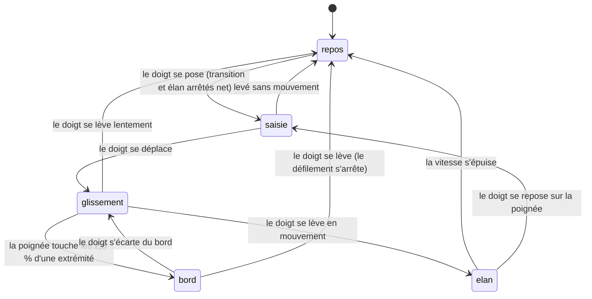

# Le glissement de la poignée

## Résumé

Tirer la [poignée](../glossary.md#le-temps) verticalement déplace la date simulée en suivi direct : la date affichée est exactement celle que la position du doigt désigne dans la fenêtre de temps. Le doigt levé en mouvement, la date continue de défiler sur son élan puis s'arrête. Tirée tout contre une extrémité de sa course, la poignée déclenche le défilement au bord : la fenêtre elle-même se met à défiler, sans limite, tant que le doigt y reste. Le simple contact avec la poignée arrête net toute transition de date ou tout élan en cours — c'est aussi le moyen de « rattraper » une animation en vol. Pendant tout le geste, la poignée grossit et s'écarte du bord, et les planètes laissent des traces orientées dans le sens du défilement. Le geste ne touche jamais ni la sélection, ni la caméra : seulement la date.

## Le cas simple

L'utilisateur pose le doigt sur la pastille blanche datée, au bord droit de l'écran. Elle grossit légèrement, s'écarte du bord vers la gauche — dégagée de sous le doigt, elle reste lisible — et son ombre s'accentue. Il la tire vers le bas : la date avance, affichée en continu dans la pastille (« 25 août 2026 » au pas Jour), et les planètes se mettent à glisser sur leurs orbites en laissant derrière elles des arcs lumineux. Vers le haut, la date recule.

Il lâche la poignée en plein mouvement : la date continue de filer dans la même direction, en ralentissant, puis s'arrête d'elle-même. La poignée, elle, ne bouge plus : c'est le temps qui coule dessous. Elle reprend sa taille et sa place contre le bord dès le lever du doigt, et reste à la hauteur où le geste l'a laissée — seules les transitions de date et le changement de pas la replacent à sa position de repos (62 %).

S'il veut aller plus loin que la fenêtre, il tire la poignée jusqu'en bas : arrivée tout contre l'extrémité, la fenêtre défile continûment vers le futur, indéfiniment, jusqu'à ce qu'il écarte le doigt du bord ou le lève.

## L'interaction, événement par événement

### Le doigt se pose

Contrairement aux gestes de scène, le contact agit immédiatement, sans seuil d'engagement :

- toute [transition de date](../glossary.md#le-temps) en cours s'arrête net, à la date qu'elle avait atteinte ;
- tout élan en cours est coupé ;
- la poignée grossit (×1,06), s'écarte du bord de 72 pt vers la gauche et son ombre s'accentue, en 0,16 s.

La date, elle, ne bouge pas : la position du doigt à la saisie correspond à la date courante.

> Note technique : la zone tactile est la pastille elle-même, pas toute la hauteur du bord droit. Le geste est reconnu dès le premier événement de toucher (distance minimale zéro) : poser le doigt, c'est déjà saisir.

### Levé sans mouvement

Le doigt se lève sans avoir bougé : la poignée reprend sa taille et sa place contre le bord, la date reste où elle est. Rien d'autre — pas d'action de tap. L'effet utile est celui du contact lui-même : une transition ou un élan attrapés au vol restent arrêtés là où on les a saisis.

### Le geste s'engage

Le premier déplacement du doigt compte : il n'y a pas de seuil. La position de la poignée à la saisie sert de référence, et chaque déplacement vertical du doigt s'y ajoute. À partir de là, le doigt possède la date : rien d'autre ne peut l'écrire tant qu'il reste posé (à une exception près, voir [Annulation et interruption](#annulation-et-interruption)).

### Pendant le geste

La date suit le doigt en suivi direct : déplacer la poignée de toute sa course traverse toute la fenêtre, du passé (en haut) au futur (en bas). La poignée est bornée à sa course ; si le doigt continue au-delà, elle reste en butée.

- **La date affichée** se met à jour en continu dans la pastille, formatée selon le [pas](../glossary.md#le-temps) : heure et minute au pas Heure, jour au pas Jour et Mois, mois et année seuls au pas Année (les formats exacts sont dans [Temps et timeline](../foundations/temps-et-timeline.md#laffichage-de-la-date)).
- **Les traces** : dès que le temps défile assez vite, chaque planète — et les lunes visibles — laisse un arc de sa trajectoire récente, orienté dans le sens du défilement, d'autant plus long et opaque que le geste est rapide (voir [Temps et timeline](../foundations/temps-et-timeline.md#les-traces-de-défilement)).
- **La vitesse du geste** est mesurée en continu (moyenne lissée des derniers déplacements), plafonnée à un quart de la fenêtre par seconde : c'est elle qui deviendra l'élan.
- **Le défilement au bord** : quand la poignée entre dans les 2,5 % d'une extrémité de sa course, la fenêtre se met à défiler continûment dans cette direction — vers le passé en haut, vers le futur en bas — à environ un dixième de fenêtre par seconde. La poignée reste collée au bord, la date continue de courir. Le doigt qui s'écarte du bord arrête le défilement et reprend le suivi direct. Il n'y a pas de butée : on peut défiler vers n'importe quelle date, dans les deux sens.

### Le doigt se lève

Si le doigt se lève en mouvement, la date continue sur son élan : la vitesse du geste devient vitesse de défilement, puis décroît exponentiellement jusqu'à l'arrêt (constantes dans [Temps et timeline](../foundations/temps-et-timeline.md#les-vitesses)). Un lever lent — vitesse sous le seuil de 0,003 jour/ms — arrête la date net, sans élan. Pendant l'élan, la poignée ne bouge pas : la fenêtre défile sous elle, et la date affichée continue de tourner dans la pastille.

Dans tous les cas, la poignée reprend son apparence de repos (taille, position contre le bord, ombre) en 0,16 s, et reste à la hauteur où le geste l'a laissée. Rien n'est « acté » : pas d'annulation possible ni nécessaire, le geste suivant repart de la date courante.

## Variantes

| Variante | Au début du geste | Pendant le geste |
| --- | --- | --- |
| Sélection courante | Aucun effet sur la saisie. | L'astre sélectionné reste centré pendant que le temps défile — la caméra le suit dans son déplacement orbital. Une sonde tirée hors de sa période de validité disparaît de la scène (la sélection, elle, est conservée) ; un satellite tiré hors de la fenêtre SGP4 se fige et s'estompe. |
| Panneau Explorer ouvert | Le panneau reste ouvert ; la poignée se saisit normalement là où elle n'est pas recouverte (voir [Cas limites](#cas-limites)). | Aucun effet sur le geste. L'onglet Satellites peut voir sa note passer à « Positions indicatives » si la date sort de la fenêtre SGP4. |
| Cartouche déplié | Le cartouche reste déplié ; même réserve de recouvrement qu'avec le panneau. | Aucun effet sur le geste. |
| Échelle de temps choisie | C'est la variante qui change tout : le pas fixe l'étendue de la fenêtre, donc la finesse du suivi direct (une même course couvre 4,2 jours au pas Heure, un siècle au pas Année), le plafond d'élan, la vitesse du défilement au bord et le format de la date affichée. | Mêmes effets, en continu. Le pas ne peut pas changer pendant le geste (le menu d'échelle demande un tap ailleurs). |

## Annulation et interruption

| Événement | Avant l'engagement (doigt posé) | Pendant le geste |
| --- | --- | --- |
| Taper le vide | Un autre doigt qui tape la scène désélectionne tout ; la date et la poignée saisie n'en sont pas affectées. | Même chose : la désélection n'a aucun effet temporel, le glissement continue. |
| Un deuxième doigt se pose | Sur la poignée : ignoré, le glissement de poignée est à un doigt. Sur la scène : les gestes de caméra vivent leur vie en parallèle. | Même chose — on peut orbiter d'une main en faisant défiler le temps de l'autre. Il n'y a pas de « prendre la main » sur la poignée. |
| Une transition de date démarre | Impossible depuis la poignée elle-même (le contact les arrête) ; possible depuis un second doigt (lien de date du cartouche, sonde hors période dans le panneau). | Le glissement ne l'annule pas : la transition et le doigt écrivent alors la date chacun leur tour, en conflit visible. Défaut soupçonné (voir [Questions ouvertes](#questions-ouvertes-et-vérification)). |
| Le système annule le toucher | La poignée reprend son apparence de repos ; rien d'autre n'avait commencé. | Le glissement s'arrête là où il en est ; l'élan démarre selon la dernière vitesse connue, comme à un lever normal. |
| L'app passe en arrière-plan | La date est conservée telle quelle. | Même chose : au retour, la poignée est là où le geste l'a laissée. Une transition en cours court sur l'horloge réelle ; le devenir exact d'un élan est en question ouverte. |
| La cible disparaît | Sans objet : le geste ne vise pas de cible. | C'est ce geste qui fait disparaître des cibles (sonde hors période, satellite hors fenêtre SGP4), jamais l'inverse : aucune disparition n'interrompt le glissement. |
| Le réseau manque | Aucun effet : le temps est entièrement local. | Aucun effet. |
| L'appareil pivote | Aucun effet particulier. | La course de la poignée change de longueur avec l'écran ; la position relative de la poignée et la date sont conservées, et les déplacements du doigt sont réinterprétés dans la nouvelle course. |

Après toute interruption, la date reste exactement où le geste l'a laissée : aucun état partiel, aucun retour en arrière.

## Interactions avec les autres systèmes

**Caméra et cadrage.** Aucun contrôle de caméra : le geste vit entièrement sur la poignée. La caméra continue de suivre sa cible pendant que le temps la déplace ; un geste d'orientation simultané (autre main) se compose sans conflit.

**Temps simulé.** C'est le geste central du temps : le seul moyen manuel et continu de déplacer la date. Toutes les constantes — fenêtres par pas, plafond et décroissance de l'élan, seuils du défilement au bord, formats de date — appartiennent à [Temps et timeline](../foundations/temps-et-timeline.md).

**Sélection.** Jamais modifiée par le geste. En revanche, tout ce que la date pilote change sous les yeux de l'utilisateur : visibilité des sondes et satellites, rotation du globe, positions.

**Réseau et replis.** Aucune interaction directe. Défiler loin peut sortir de la fenêtre SGP4, dont la note et les estompages sont décrits dans [Données et réseau](../foundations/donnees-et-reseau.md).

**Échelles compressées.** Les traces suivent les trajectoires dans l'espace compressé de la scène, comme les astres eux-mêmes.

**Localisation et langue.** La date de la poignée est formatée en français quelle que soit la langue du téléphone.

> Note technique : le formateur de date est verrouillé sur la locale `fr_FR` ; l'app n'est pas localisée.

**Accessibilité.** La poignée n'expose ni action ni valeur ajustable à VoiceOver ; il n'existe aucun moyen alternatif de déplacer la date en continu (les liens de date et « Aujourd'hui » restent des boutons ordinaires).

## Cas limites

- **Au pas Heure, l'élan ne part jamais** : le plafond de vitesse (fenêtre/4 par seconde, soit ~0,001 jour/ms pour 4,2 jours) est inférieur au seuil de déclenchement de l'élan (0,003 jour/ms). Tout lever de doigt y arrête la date net. Défaut soupçonné.
- **Immobiliser le doigt puis lever** : la vitesse mesurée ne décroît pas pendant l'immobilité ; un lever après une pause peut relancer un élan « fantôme » à la vitesse d'avant la pause. Défaut soupçonné.
- **Lâcher la poignée au bord** : l'élan est inhibé *pendant* le défilement au bord, mais le lever du doigt au bord peut en déclencher un, calé sur la dernière vitesse mesurée avant d'atteindre le bord. Défaut soupçonné.
- **Doigt loin au-delà de la course** : la poignée reste en butée et le défilement au bord continue, même si le doigt est sorti de l'écran par le bas ou glisse horizontalement — seul compte le déplacement vertical depuis la saisie.
- **Panneau Explorer ouvert ou cartouche déplié** : ces surfaces sont empilées au-dessus de la timeline et peuvent recouvrir le bas de la course de la poignée ; la poignée qui s'y trouve pourrait être insaisissable. À vérifier à la main.
- **Traverser la fenêtre d'un geste vif** : les traces atteignent leur longueur et leur opacité maximales, puis s'estompent en une demi-seconde après l'arrêt.
- **Saisir la poignée pendant une séquence de tir** : la transition de date de la séquence s'arrête net comme n'importe quelle autre ; le reste de la séquence est décrit dans [explorer/lancements.md](../explorer/lancements.md).

## Questions ouvertes et vérification

- Les trois défauts soupçonnés ci-dessus (élan impossible au pas Heure, élan « fantôme » après pause, élan au lâcher depuis le bord) sont lus dans le code, pas observés ; à reproduire puis consigner dans `bug-triage.md`.
- Le conflit entre un glissement en cours et une transition de date déclenchée par un second doigt (lien de date, sélection dans le panneau) n'est pas arbitré dans le code : le rendu visible du conflit est à observer.
- Le recouvrement de la course de la poignée par le panneau Explorer ou le cartouche déplié est déduit de l'ordre d'empilement des vues, pas observé.
- Le comportement à l'annulation système du geste (appel entrant pendant le glissement) est déduit du fonctionnement standard de SwiftUI ; il n'est pas certain que la fin de geste soit toujours notifiée — la poignée pourrait rester grossie.
- Au retour d'arrière-plan, l'élan reprend par pas de rendu plafonnés (il est quasi suspendu pendant l'absence) alors qu'une transition court sur l'horloge réelle ; la nuance avec la formulation des fondations est à trancher par l'observation.
- La vitesse ressentie du défilement au bord (« un dixième de fenêtre par seconde ») est calculée, pas chronométrée.

Vérifié contre le dossier natif au commit `bb3744e`.
